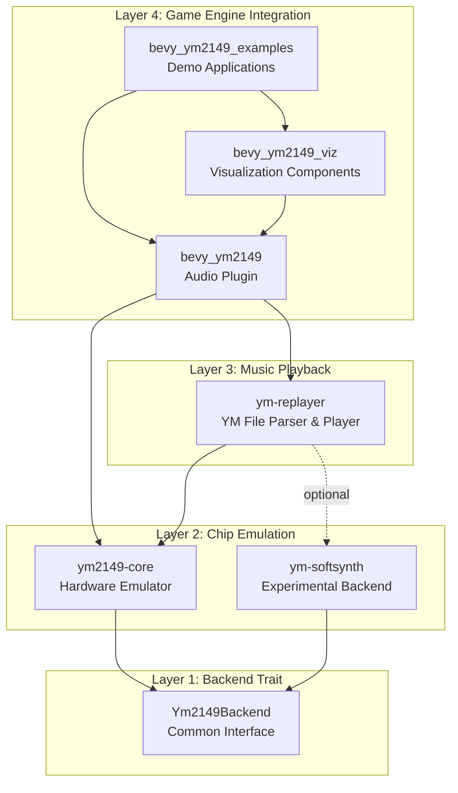

# YM2149-RS Workspace Architecture

Complete architecture documentation for the YM2149 emulation and playback toolkit.

## Overview

YM2149-RS is a modular Rust workspace providing cycle-accurate YM2149 PSG emulation, YM file playback, and Bevy game engine integration. The architecture follows strict separation of concerns with clear layer boundaries.

## Architectural Layers



## Crate Responsibilities

| Crate | Layer | Purpose | Public API | Binaries/Examples |
|-------|-------|---------|------------|-------------------|
| **ym2149-core** | 2 | Cycle-accurate YM2149 chip emulation | `Ym2149`, `Ym2149Backend` trait, streaming, visualization | `chip_demo` example |
| **ym-softsynth** | 2 | Experimental synthesizer backend | `SoftSynth` (implements `Ym2149Backend`) | None (library only) |
| **ym-replayer** | 3 | YM file parsing and playback | `Ym6Player`, `load_song()`, parsers, loader, export | `ym-replayer` CLI, `export` example |
| **bevy_ym2149** | 4 | Bevy audio plugin with playback management | `Ym2149Plugin`, `Ym2149Playback` component | None (library only) |
| **bevy_ym2149_viz** | 4 | Visualization systems (scope, spectrum, UI) | Visualization components & systems | None (library only) |
| **bevy_ym2149_examples** | 4 | Runnable demo applications | None (examples only) | 5 example applications |

---

## Data Flow: YM File to Audio Output

```mermaid
sequenceDiagram
    participant File as YM File
    participant Loader as ym-replayer::loader
    participant Parser as ym-replayer::parser
    participant Player as Ym6Player
    participant Chip as Ym2149
    participant Audio as Audio Device

    File->>Loader: read bytes
    Loader->>Loader: detect LHA compression
    Loader-->>Parser: decompressed bytes
    Parser->>Parser: detect format (YM2-YM6)
    Parser->>Parser: parse frames & metadata
    Parser-->>Player: frames + LoadSummary

    loop Every frame (50Hz / 882 samples)
        Player->>Player: decode effects
        Player->>Chip: load_registers(&[u8; 16])
        Player->>Chip: apply effects (SID/DigiDrum/Buzzer)

        loop 882 samples
            Player->>Chip: clock()
            Chip->>Chip: update generators
            Chip-->>Player: get_sample() -> f32
        end

        Player-->>Audio: Vec<f32> samples
    end
```

---

## Layer 1: Backend Trait

### Purpose
Defines a common interface for all YM2149 chip implementations, enabling alternative backends.

### Trait Definition
```rust
pub trait Ym2149Backend: Send {
    fn new() -> Self where Self: Sized;
    fn with_clocks(master_clock: u32, sample_rate: u32) -> Self where Self: Sized;
    fn reset(&mut self);
    fn write_register(&mut self, addr: u8, value: u8);
    fn read_register(&self, addr: u8) -> u8;
    fn load_registers(&mut self, regs: &[u8; 16]);
    fn dump_registers(&self) -> [u8; 16];
    fn clock(&mut self);
    fn get_sample(&self) -> f32;
    fn generate_samples(&mut self, count: usize) -> Vec<f32>;
    fn get_channel_outputs(&self) -> (f32, f32, f32);
    fn set_channel_mute(&mut self, channel: usize, mute: bool);
    fn is_channel_muted(&self, channel: usize) -> bool;
    fn set_color_filter(&mut self, enabled: bool);
}
```

### Design Rationale
- **Send bound**: Enables multi-threaded audio pipelines
- **Associated types avoided**: Simple generic parameter for flexibility
- **Register-level API**: Matches hardware interface for accuracy
- **Sample-level control**: Allows precise timing control

---

## Layer 2: Chip Emulation

### ym2149-core

**Hardware-accurate emulation** of the YM2149 PSG chip.

**Architecture:**
```
Ym2149
├── 3x ToneGenerator (square wave, 12-bit frequency)
├── NoiseGenerator (17-bit LFSR)
├── EnvelopeGenerator (16 shapes, lookup table)
├── Mixer (AND gate logic, per-channel control)
└── ColorFilter (optional ST-style filtering)
```

**Key Features:**
- Fixed-point phase accumulators (16.16 format)
- Pre-computed envelope tables (16 shapes × 65K values)
- Zero allocations in hot path
- Hardware-specific methods for YM6 effects:
  - `set_mixer_overrides()` - For SID/Buzzer
  - `set_drum_sample_override()` - For DigiDrums
  - `trigger_envelope()` - For Sync Buzzer

**Performance:**
- ~1-2 µs per sample
- ~5% CPU @ 44.1 kHz sustained

**See:** [ym2149-core/ARCHITECTURE.md](crates/ym2149-core/ARCHITECTURE.md)

### ym-softsynth

**Experimental synthesizer** backend for non-critical applications.

**Status:** Work in progress, not production-ready

**Implements:** `Ym2149Backend` trait

**Provides:**
- Basic 3-channel tone generation
- Volume control
- Lightweight alternative to hardware emulation

**Limitations:**
- No envelope generator
- No noise generator
- No hardware effects
- Not cycle-accurate

**Use Cases:**
- Educational/prototyping
- Low-resource environments
- Simple PSG experimentation

**Note:** `SoftPlayer` has been disabled due to circular dependencies. Use `Ym6Player` with `SoftSynth` backend once generic backend support is implemented in ym-replayer.

---

## Streaming & Export Modules

### Where is Streaming?

**Location:** `ym2149-core/src/streaming/`

**Rationale:** Streaming (RingBuffer, AudioDevice, RealtimePlayer) is kept in ym2149-core because:
1. It's generic audio infrastructure, not YM-file-specific
2. Can be used for direct chip streaming without file parsing
3. Provides foundation for both CLI player and potential future use cases

**Components:**
- `RingBuffer` - Lock-free circular buffer for producer/consumer threading
- `AudioDevice` - CPAL/rodio audio output wrapper
- `RealtimePlayer` - Real-time sample generation wrapper
- `StreamConfig` - Configuration for latency, sample rate, channels

**Usage:** Available via `ym2149::streaming::*` when `streaming` feature is enabled.

### Where is Export?

**Location:** `ym2149-core/src/export/`

**Rationale:** Export (WAV/MP3 generation) is kept in ym2149-core because:
1. Works with any sample source, not just YM files
2. The `export` example in ym2149-core demonstrates full pipeline
3. Can export from direct chip synthesis or YM playback

**Components:**
- `export_to_wav_with_config()` - WAV file generation
- `export_to_mp3_with_config()` - MP3 file generation
- `ExportConfig` - Stereo, normalization, fade settings

**Usage:** Available via `ym2149::export::*` when `export-wav` or `export-mp3` features are enabled.

---

## Layer 3: Music Playback (ym-replayer)

### Responsibilities

1. **YM File Parsing**
   - Format detection (YM2/3/3b/4/5/6, YMT1/YMT2)
   - LHA decompression (automatic)
   - Frame extraction and de-interleaving
   - Metadata parsing

2. **Playback Orchestration**
   - Frame sequencing @ 50Hz VBL timing
   - Playback state management (Play/Pause/Stop)
   - Loop point handling
   - Sample generation coordination

3. **Effects Processing**
   - SID voice effects
   - Sync Buzzer effects
   - Mad Max DigiDrums
   - Effect decoding from register data

### Module Organization

```
ym-replayer/src/
├── parser/
│   ├── ym.rs              # YM2-YM5 parser
│   ├── ym6.rs             # YM6 format parser
│   ├── effects.rs         # Effect command decoder
│   └── mod.rs             # FormatParser trait
├── compression/
│   └── mod.rs             # LHA decompression
├── loader/
│   └── mod.rs             # High-level file loading API
├── player/
│   ├── ym_player.rs       # Ym6Player implementation
│   ├── effects_manager.rs # Effect state management
│   ├── vbl_sync.rs        # VBL timing helpers
│   ├── cycle_counter.rs   # Cycle-accurate counting
│   └── tracker_player.rs  # YMT tracker support
└── lib.rs                 # Public exports
```

### Playback Algorithm

```
initialize(ym_file):
  ├─ detect_format() → YM2/3/4/5/6
  ├─ decompress_if_needed() → raw bytes
  ├─ parse_frames() → Vec<[u8; 16]>
  ├─ parse_metadata() → title, author, etc.
  └─ create player(frames, metadata)

generate_samples(count):
  for each sample:
    if frame_position == 0:
      ├─ load current frame registers
      ├─ decode effects from registers
      └─ apply effects to chip

    chip.clock()
    sample = chip.get_sample()

    frame_position++
    if frame_position >= samples_per_frame:
      frame_position = 0
      current_frame++
      if current_frame >= total_frames:
        if loop_enabled:
          current_frame = loop_point
        else:
          stop()
```

### Why Not Generic Over Backend?

**Decision:** `Ym6Player` uses concrete `Ym2149` type, not generic `B: Ym2149Backend`

**Reason:** YM6 hardware effects require methods not in the trait:
- `set_mixer_overrides()` (SID voice, Sync Buzzer)
- `set_drum_sample_override()` (DigiDrums)
- `trigger_envelope()` (Sync Buzzer)

These are hardware-specific features that don't make sense in a generic backend interface. SoftSynth cannot play YM6 files with effects.

---

## Layer 4: Bevy Integration

### bevy_ym2149

**Bevy ECS plugin** for YM2149 audio playback in games.

**Architecture:**
```
Ym2149Plugin
├── Asset Loading
│   ├── Ym2149Loader (handles .ym files)
│   └── Ym2149AudioSource (asset type)
├── Playback Management
│   ├── Ym2149Playback (component)
│   ├── PlaybackState (Playing/Paused/Stopped)
│   └── Audio sink integration
├── Systems
│   ├── asset_loading_system
│   ├── playback_update_system
│   ├── audio_bridge_system
│   └── event_emission_system
└── Events
    ├── TrackStarted
    ├── TrackFinished
    └── ChannelSnapshot
```

**Key Features:**
- Automatic asset loading via Bevy asset system
- ECS component-based playback management
- Playlist support with crossfading
- Audio bridge for Bevy spatial audio
- Diagnostics and metrics
- Event system for game logic integration

**Integration Points:**
```rust
App::new()
    .add_plugins(Ym2149Plugin::default())
    .add_systems(Startup, |mut commands: Commands| {
        commands.spawn(Ym2149Playback::new("music/song.ym"));
    })
```

### bevy_ym2149_viz

**Visualization components** for YM2149 audio in Bevy applications.

**Components:**
- `Oscilloscope` - Real-time waveform display
- `SpectrumAnalyzer` - Frequency spectrum bars
- `ProgressBar` - Playback progress indicator
- `ChannelActivity` - Per-channel activity meters
- `VuMeter` - Volume level visualization

**Architecture:**
```
Ym2149VizPlugin
├── Oscilloscope System
│   ├── Buffer sampling
│   ├── Waveform rendering
│   └── UI integration
├── Spectrum System
│   ├── FFT processing
│   ├── Frequency bins
│   └── Bar rendering
└── UI Components
    ├── Progress tracking
    ├── Metadata display
    └── Channel status
```

### bevy_ym2149_examples

**Demo applications** showcasing features:

| Example | Features Demonstrated |
|---------|----------------------|
| `basic_example` | Simple playback, asset loading |
| `advanced_example` | Full UI, oscilloscope, spectrum, controls |
| `crossfade_example` | Playlist with smooth transitions |
| `feature_showcase` | Per-channel mute, diagnostics, events |
| `demoscene` | Visual effects synchronized to music |

---

## Cross-Layer Communication Patterns

### Pattern 1: Asset Loading (Bevy → Replayer → Core)

```
User spawns Ym2149Playback("song.ym")
    ↓
Bevy asset system loads file
    ↓
Ym2149Loader::load()
    ↓
ym_replayer::loader::load_bytes()
    ↓
Parser extracts frames
    ↓
Ym6Player created with Ym2149 chip
    ↓
Component initialized with player
```

### Pattern 2: Sample Generation (Core ← Replayer ← Bevy)

```
Bevy audio sink requests samples
    ↓
playback_update_system()
    ↓
Ym6Player::generate_samples()
    ↓
For each frame:
  ├─ Decode effects
  ├─ Ym2149::load_registers()
  └─ For each sample:
      └─ Ym2149::clock() → f32
    ↓
Samples written to audio sink
```

### Pattern 3: Effect Application (Replayer → Core)

```
Ym6Player decodes effect commands
    ↓
EffectsManager::update()
    ↓
Match effect type:
  ├─ SID → Ym2149::set_mixer_overrides()
  ├─ DigiDrum → Ym2149::set_drum_sample_override()
  └─ Buzzer → Ym2149::trigger_envelope()
```

---

## Dependency Graph

```
bevy_ym2149_examples
        │
        ├──→ bevy_ym2149_viz
        │           │
        │           └──→ bevy_ym2149
        │                       │
        └───────────────────────┴──→ ym-replayer
                                            │
                                            ├──→ ym2149-core
                                            │
                                            └──→ ym-softsynth (optional)
                                                        │
                                                        └──→ ym2149-core
```

**Key Principles:**
- No circular dependencies
- Clear layer boundaries
- Optional features via Cargo features
- Minimal coupling between layers

---

## Threading Model (Optional Streaming)

When `streaming` feature is enabled:


**Components:**
- `RingBuffer` - Lock-free circular buffer with atomic indices
- `RealtimePlayer` - Sample generation thread
- `AudioDevice` - CPAL audio output thread

**Latency:** ~120-150ms end-to-end (configurable buffer size)

**See:** [STREAMING_GUIDE.md](STREAMING_GUIDE.md)

---

## Feature Flag Matrix

| Feature | ym2149-core | ym-replayer | bevy_ym2149 |
|---------|-------------|-------------|-------------|
| `emulator` | ✓ (default) | - | - |
| `streaming` | ✓ | ✓ | ✓ |
| `visualization` | ✓ | - | - |
| `effects` | - | ✓ (default) | - |
| `tracker` | - | ✓ (default) | - |
| `digidrums` | - | ✓ (default) | - |
| `export-wav` | ✓ | ✓ | - |
| `export-mp3` | ✓ | ✓ | - |

---

## Performance Characteristics

### Memory Footprint

| Component | Memory Usage |
|-----------|--------------|
| Ym2149 chip instance | ~1 KB |
| Ym6Player (3-minute song) | ~1-2 MB (frames) |
| RingBuffer (16KB) | 16 KB |
| Bevy playback component | ~2 KB + player |

### CPU Usage (44.1 kHz)

| Operation | Time | CPU % |
|-----------|------|-------|
| Ym2149::clock() | 1-2 µs | 5% (sustained) |
| Effect processing | 0.2-0.5 µs | included |
| Frame loading | ~10 µs | negligible |
| Total playback | ~45-90 ms/sec | 5-10% |

---

## Migration from v0.5 to v0.6

### Breaking Changes
Code using deprecated modules must update imports:

```rust
// v0.5 (deprecated but still works)
use ym2149::replayer::Ym6Player;
use ym2149::ym_loader;

// v0.6 (recommended)
use ym_replayer::Ym6Player;
use ym_replayer::loader;
```

### Backward Compatibility
Old paths emit deprecation warnings with migration guidance. All deprecated code remains functional in v0.6.

---

## Testing Strategy

### Unit Tests
- **ym2149-core:** Chip component tests (generators, mixer, registers)
- **ym-replayer:** Parser tests, effect decoding, playback logic
- **bevy_ym2149:** System tests, component lifecycle

### Integration Tests
- **ym-replayer:** Full file loading and playback
- **bevy_ym2149:** Asset loading, playback coordination

### Current Status
**253 tests passing** across workspace

```bash
cargo test --workspace
```

---

## Design Principles

1. **Separation of Concerns**
   - Chip emulation independent of file formats
   - Playback independent of UI/game engine
   - Clear layer boundaries

2. **Backend Abstraction**
   - `Ym2149Backend` trait for alternative implementations
   - Effects use hardware-specific methods when needed
   - Balance between generics and pragmatism

3. **Zero-Cost Abstractions**
   - No allocations in sample generation hot path
   - Inline-friendly design
   - Fixed-point math for precision without overhead

4. **Modular Features**
   - Optional dependencies via Cargo features
   - Minimal default footprint
   - Pay only for what you use

5. **Idiomatic Rust**
   - Strong typing for safety
   - Ownership for zero-copy
   - Traits for extensibility
   - Atomics for lock-free concurrency

---

## Related Documentation

- [ym2149-core Architecture](crates/ym2149-core/ARCHITECTURE.md) - Chip emulation details
- [Streaming Guide](STREAMING_GUIDE.md) - Real-time audio architecture
- [ym-replayer README](crates/ym-replayer/README.md) - Playback layer API
- [bevy_ym2149 README](crates/bevy_ym2149/README.md) - Bevy integration guide

---

## Future Considerations

### Potential Enhancements
- WASM support for web playback
- Additional backends (e.g., FPGA cores)
- YM7 format support
- MIDI export capabilities
- Advanced DSP effects

### Architectural Stability
The current layer separation provides a stable foundation for these enhancements without requiring major refactoring.
