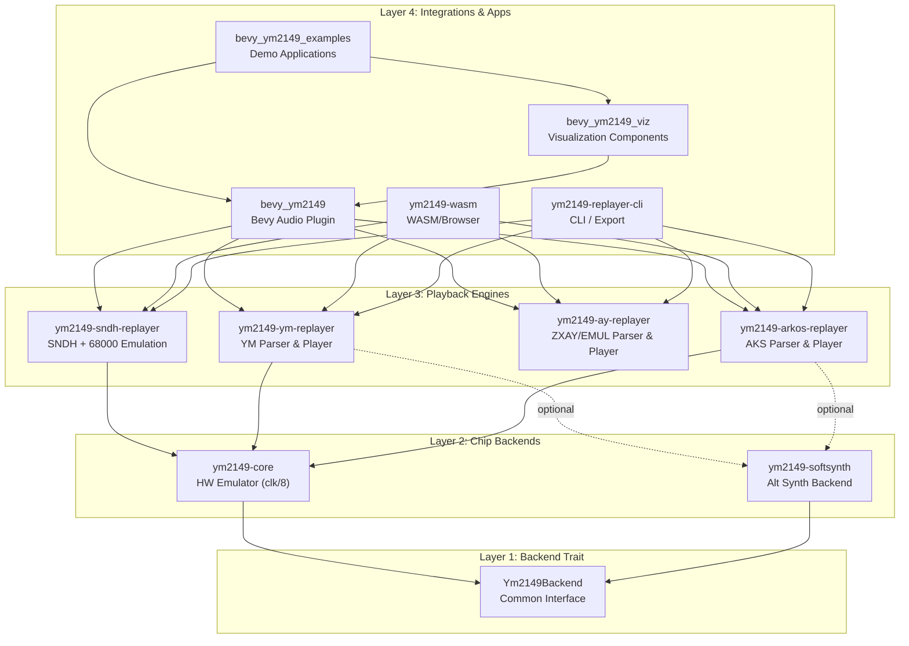
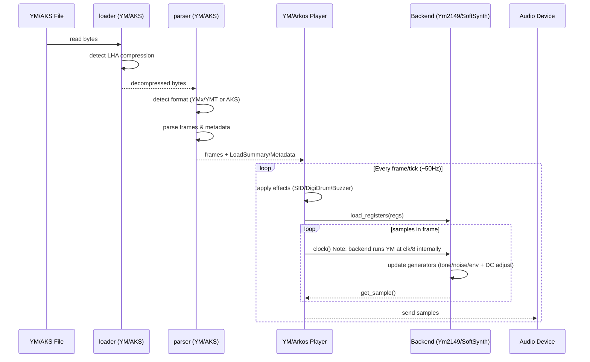
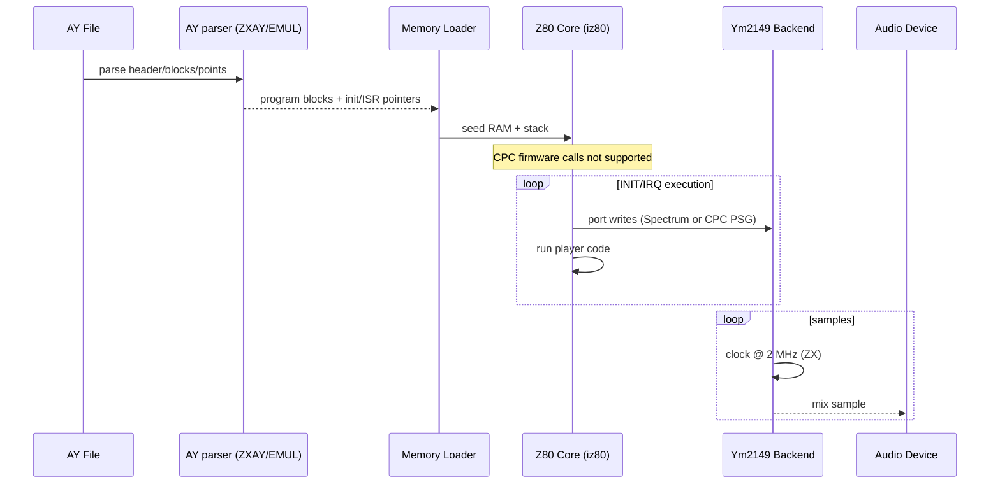
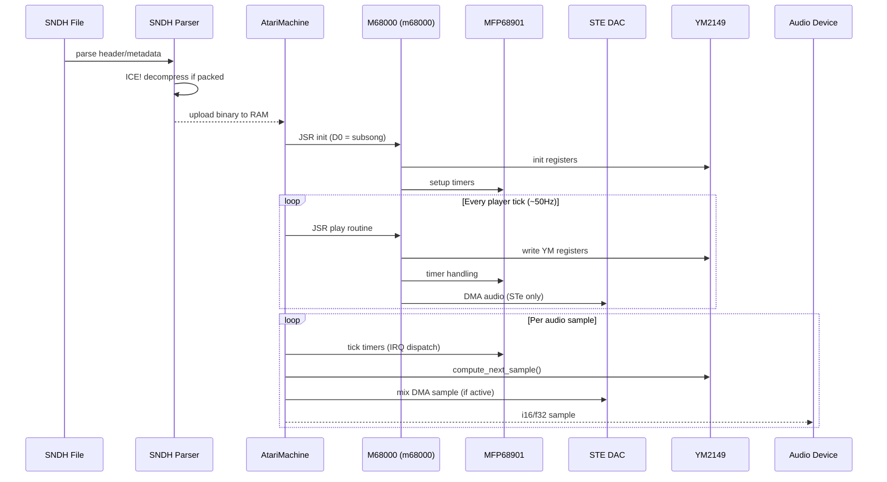
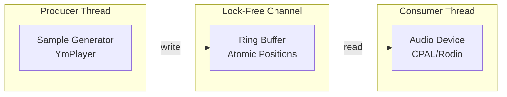
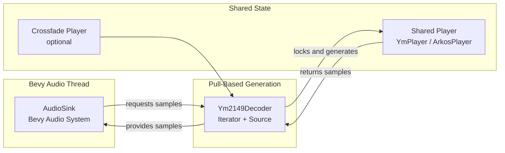

# YM2149-RS Workspace Architecture

Complete architecture documentation for the YM2149 emulation and playback toolkit.

## Overview

YM2149-RS is a modular Rust workspace providing cycle-accurate YM2149 PSG emulation, YM file playback, and Bevy game engine integration. The architecture follows strict separation of concerns with clear layer boundaries.

## Architectural Layers



## Crate Responsibilities

| Crate | Layer | Purpose | Public API | Notes |
|-------|-------|---------|------------|-------|
| **ym2149-core** | 2 | Cycle-accurate YM2149 chip emulation (clk/8, 32-step vols/env) | `Ym2149`, `Ym2149Backend`, streaming helpers | Used by every higher layer |
| **ym2149-softsynth** | 2 | Experimental synthesizer backend | `SoftSynth` | Optional backend prototype |
| **ym2149-ym-replayer** | 3 | YM file parsing and playback | `YmPlayer`, `load_song()` | Powers CLI/Bevy/WASM YM playback |
| **ym2149-arkos-replayer** | 3 | Arkos Tracker `.aks` parsing and multi-PSG playback | `ArkosPlayer`, `load_aks()` | Supports multi-chip Arkos rips |
| **ym2149-ay-replayer** | 3 | Project AY ZXAY/EMUL parsing + Z80 replayer | `AyPlayer`, `load_ay()` | ZX-only; CPC AY files rejected (firmware unsupported) |
| **ym2149-sndh-replayer** | 3 | SNDH (Atari ST) parser + 68000/MFP/STE-DAC emulation | `SndhPlayer`, `load_sndh()` | Native 68000 code execution via m68000 crate |
| **bevy_ym2149** | 4 | Bevy audio plugin with YM/AKS/AY/SNDH players | `Ym2149Plugin`, `YmSongPlayer` | Handles streaming & hot-reload |
| **bevy_ym2149_viz** | 4 | Visualization systems (scope, spectrum, UI) | Visualization ECS systems | Consumed by example scenes |
| **bevy_ym2149_examples** | 4 | Runnable Bevy demos | Example scenes | Demonstrates plugin usage |
| **ym2149-wasm** | 4 | WebAssembly bindings & browser player | `Ym2149Player` (wasm-bindgen API) | Auto-detects YM/AKS/AY/SNDH (CPC AY disabled) |
| **ym2149-replayer-cli** | 4 | Terminal streaming/export CLI | `main.rs` | Streams YM/AKS/ZX-AY/SNDH (CPC AY rejected with warning) |

---

## Data Flow: YM File to Audio Output



### AY (ZXAY/EMUL) Flow (ZX Spectrum only)



> **Firmware limit**: AY playback only supports tracks that keep all
> logic inside their bundled code. Calls into the Spectrum/CPC ROM jump
> tables are treated as unsupported and playback stops (no ROMs are
> bundled or emulated).

### SNDH (Atari ST) Flow



> **Architecture:** SNDH files contain native 68000 machine code that must be
> executed on an emulated Atari ST. The `ym2149-sndh-replayer` provides complete
> machine emulation including MFP 68901 timers (for SID voice effects) and
> STE DAC (for DMA audio). The YM2149 emulation is shared with other replayers.

---

## Layer 1: Backend Trait & Player Traits

### Chip Backend Trait

Defines a common interface for all YM2149 chip implementations, enabling alternative backends.

```rust
pub trait Ym2149Backend: Send {
    fn new() -> Self where Self: Sized;
    fn with_clocks(master_clock: u32, sample_rate: u32) -> Self where Self: Sized;
    fn reset(&mut self);
    fn write_register(&mut self, addr: u8, value: u8);
    fn read_register(&self, addr: u8) -> u8;
    fn load_registers(&mut self, regs: &[u8; 16]);
    fn dump_registers(&self) -> [u8; 16];
    fn clock(&mut self);
    fn get_sample(&self) -> f32;
    fn generate_samples(&mut self, count: usize) -> Vec<f32>;
    fn get_channel_outputs(&self) -> (f32, f32, f32);
    fn set_channel_mute(&mut self, channel: usize, mute: bool);
    fn is_channel_muted(&self, channel: usize) -> bool;
    fn set_color_filter(&mut self, enabled: bool);
}
```

### Player Trait Hierarchy (ym2149-common)

The player traits provide a unified interface across all replayers:

```rust
// Object-safe base trait for dynamic dispatch
pub trait ChiptunePlayerBase: Send {
    fn play(&mut self);
    fn pause(&mut self);
    fn stop(&mut self);
    fn state(&self) -> PlaybackState;
    fn is_playing(&self) -> bool;
    fn generate_samples_into(&mut self, buffer: &mut [f32]);
    fn generate_samples(&mut self, count: usize) -> Vec<f32>;
    fn sample_rate(&self) -> u32;
    fn set_channel_mute(&mut self, channel: usize, mute: bool);
    fn is_channel_muted(&self, channel: usize) -> bool;
    fn playback_position(&self) -> f32;
    fn subsong_count(&self) -> usize;
    fn current_subsong(&self) -> usize;
    fn set_subsong(&mut self, index: usize) -> bool;
    fn has_subsongs(&self) -> bool;
    fn psg_count(&self) -> usize;
    fn channel_count(&self) -> usize;
}

// Full trait with associated Metadata type
pub trait ChiptunePlayer: ChiptunePlayerBase {
    type Metadata: PlaybackMetadata;
    fn metadata(&self) -> &Self::Metadata;
}
```

**Usage:**
- Use `ChiptunePlayerBase` when you need trait objects (`Box<dyn ChiptunePlayerBase>`)
- Use `ChiptunePlayer` when you need access to the specific metadata type

### Design Rationale
- **Send bound**: Enables multi-threaded audio pipelines
- **Associated types avoided in base**: Keeps `ChiptunePlayerBase` object-safe for dynamic dispatch
- **Register-level API**: Matches hardware interface for accuracy
- **Sample-level control**: Allows precise timing control
- **Trait hierarchy**: Separates object-safe operations from metadata access

---

## Layer 2: Chip Emulation

### ym2149-core (clk/8 backend)

**Hardware-aligned emulation** of the YM2149 PSG using a clk÷8 model:

- Internal tick at `master_clock/8` (~250 kHz @ 2 MHz), averaged to host sample rate
- 10 hardware envelope shapes (128-step tables) + 32-step hardware volume table
- Noise LFSR and tone edges match hardware expectations (randomized power-on edges, half-rate noise)
- DC adjust ring buffer to remove offset drift
- Hardware effect hooks: `set_mixer_overrides`, `set_drum_sample_override`, `trigger_envelope`
- Trait-compatible (`Ym2149Backend`) and exported as `Ym2149`

**Performance:**
- Lightweight hot path; no heap allocations per sample
- Accurate buzzer/digidrum timing due to subclock stepping

**See:** [ym2149-core/ARCHITECTURE.md](crates/ym2149-core/ARCHITECTURE.md)

### ym2149-softsynth

**Experimental synthesizer** backend for non-critical applications.

**Status:** Work in progress, not production-ready

**Implements:** `Ym2149Backend` trait

**Provides:**
- Basic 3-channel tone generation
- Volume control
- Lightweight alternative to hardware emulation

**Limitations:**
- No envelope generator
- No noise generator
- No hardware effects
- Not cycle-accurate

**Use Cases:**
- Educational/prototyping
- Low-resource environments
- Simple PSG experimentation

**Note:** `SoftPlayer` has been disabled due to circular dependencies. Use `YmPlayer` with `SoftSynth` backend once generic backend support is implemented in ym2149-ym-replayer.

---

## Streaming & Export Modules

### Where is Streaming?

**Location:** `ym2149-core/src/streaming/`

**Rationale:** Streaming (RingBuffer, AudioDevice, RealtimePlayer) is kept in ym2149-core because:
1. It's generic audio infrastructure, not YM-file-specific
2. Can be used for direct chip streaming without file parsing
3. Provides foundation for CLI player and standalone applications
4. **Note:** `bevy_ym2149` no longer uses these modules; it uses Bevy's native audio system instead

**Components:**
- `RingBuffer` - Lock-free circular buffer for producer/consumer threading
- `AudioDevice` - CPAL/rodio audio output wrapper
- `RealtimePlayer` - Real-time sample generation wrapper
- `StreamConfig` - Configuration for latency, sample rate, channels

**Usage:** Available via `ym2149::streaming::*` when `streaming` feature is enabled (used by CLI tools, not Bevy plugin).

### Audio Export

**Status:** ✅ **Implemented** - Available via feature flags

**Location:** `ym2149-ym-replayer/src/export/`

**Supported Formats:**
- **WAV** - Uncompressed PCM audio (feature: `export-wav`)

**Features:**
- Configurable sample rate (default: 44,100 Hz)
- Mono/stereo output
- Optional audio normalization to prevent clipping
- Fade-out support with configurable duration
- Batch export capabilities

**Usage:**

Enable export feature in `Cargo.toml`:
```toml
ym2149-ym-replayer = { version = "0.7", features = ["export-wav"] }
```

Example code:
```rust
use ym2149_ym_replayer::{load_song, export::export_to_wav_default};

let data = std::fs::read("song.ym")?;
let (mut player, info) = load_song(&data)?;
export_to_wav_default(&mut player, info, "output.wav")?;
```

**Implementation Notes:**
- WAV export uses pure Rust `hound` crate
- Export is synchronous - blocks until rendering completes

---

## Layer 3: Music Playback (ym2149-ym-replayer & ym2149-arkos-replayer)

### Responsibilities (ym2149-ym-replayer)

1. **YM File Parsing**
   - Format detection (YM1/2/3/3b/4/5/6 final, YMT1/YMT2 tracker)
   - LHA decompression (automatic)
   - Frame extraction and de-interleaving
   - Metadata parsing

2. **Playback Orchestration**
   - Frame sequencing @ 50Hz VBL timing
   - Playback state management (Play/Pause/Stop)
   - Loop point handling
   - Sample generation coordination

3. **Effects & Profiles**
   - `FrameSequencer` owns register frames, loop points, and VBL timing
   - `FormatProfile` encapsulates YM2/YM5/YM6 quirks (register munging + effect decoding)
- `EffectsPipeline` wraps the low-level `EffectsManager` and tracks SID/digidrum state
- All format-specific logic now lives behind `FormatMode` strategies instead of `is_ym*_mode` flags

### Responsibilities (ym2149-arkos-replayer)

1. **Arkos Tracker Project Parsing**
   - Parses `.aks` subsongs, position tables, speed tracks, instruments, pitch/arpeggio tables
   - Validates pattern bounds and loop markers, clamps tracker note ranges to AT3 semantics

2. **Realtime Playback**
   - Tick-by-tick pattern walker with glide, pitch slides, inline/arpeggio tables, hardware envelope
   - Digidrum/sample playback pipeline with loop points and priority handling
   - PSG register conversion via shared `psg` helpers for parity with YM core

3. **Interoperability**
   - Exposed through the Bevy plugin as an alternate backend for playlists and the wasm player
   - CLI wrapper (`ArkosPlayerWrapper`) implements the shared `RealtimeChip` trait for feature parity (mute, position, color filter no-op)

### Crossfade Lifecycle (Bevy plugin)
- **Request**: `Ym2149PlaylistPlayer` sets `pending_crossfade` with target index/duration once the trigger point is hit or a manual advance is requested.
- **Loading**: `process_pending_crossfade` spawns a second `AudioPlayer` entity with the incoming track muted.
- **Active**: `drive_playback_state` mixes the two sinks by ramping sink volumes over the window while keeping the existing player running.
- **Finalize**: once elapsed >= window, the outgoing deck is stopped, state/metadata are swapped over, and the old crossfade entity is removed.

### Module Organization

```
ym2149-ym-replayer/src/
├── parser/
│   ├── ym.rs              # YM1-YM5 parser
│   ├── ym6.rs             # YM6 (final format) parser
│   ├── effects.rs         # Effect command decoder
│   └── mod.rs             # FormatParser trait
├── compression/
│   └── mod.rs             # LHA decompression
├── loader/
│   └── mod.rs             # High-level file loading API
├── player/
│   ├── ym_player.rs       # YmPlayerGeneric<B> implementation
│   ├── effects_manager.rs # Effect state management
│   ├── effects_pipeline.rs# High-level effect wrapper (SID/DigiDrum state)
│   ├── format_profile.rs  # FormatMode trait & adapters (YM2/YM5/YM6)
│   ├── ym6/               # YM6 format types and helpers
│   │   ├── types.rs       # YmFileFormat, LoadSummary, Ym6Info
│   │   ├── helpers.rs     # Binary reading utilities
│   │   └── mod.rs
│   ├── vbl_sync.rs        # VBL timing helpers
│   ├── cycle_counter.rs   # Cycle-accurate counting
│   └── tracker_player.rs  # YMT tracker support
├── export/                # Audio export (feature-gated)
│   ├── wav.rs             # WAV export (feature: export-wav)
│   └── mod.rs             # ExportConfig, normalize_samples, apply_fade_out
└── lib.rs                 # Public exports
```

### Playback Algorithm (ym2149-ym-replayer)

```
initialize(ym_file):
  ├─ detect_format() → YM1/2/3/3b/4/5/6 (final), YMT1/YMT2
  ├─ decompress_if_needed() → raw bytes
  ├─ parse_frames() → Vec<[u8; 16]>
  ├─ parse_metadata() → title, author, etc.
  └─ create player(frames, metadata)

generate_samples(count):
  for each sample:
    if frame_position == 0:
      ├─ load current frame registers
      ├─ decode effects from registers
      └─ apply effects to chip

    chip.clock()
    sample = chip.get_sample()

    frame_position++
    if frame_position >= samples_per_frame:
      frame_position = 0
      current_frame++
      if current_frame >= total_frames:
        if loop_enabled:
          current_frame = loop_point
        else:
          stop()
```

### Generic Backend with Hardware-Specific Effects (ym2149-ym-replayer)

**Implementation:** `YmPlayer` is implemented as a generic struct `YmPlayerGeneric<B: Ym2149Backend>`, allowing it to work with any backend that implements the `Ym2149Backend` trait.

**Type Aliases:** The commonly-used `YmPlayer` is the concrete hardware-accurate implementation. `Ym6Player` remains as a legacy alias for downstream crates:
```rust
pub type YmPlayer = YmPlayerGeneric<Ym2149>;
pub type Ym6Player = YmPlayer;
```

**Timing configuration:** `YmPlayer` defaults to 44.1 kHz @ 2 MHz master clock, but you can override the host rate via `YmPlayer::with_sample_rate` or `set_sample_rate`. YM5/YM6 headers update the master clock automatically via `apply_master_clock`, so non-2MHz rips (or downsampled hosts) stay accurate.

**Hardware Effects Support:** YM6 format includes special Atari ST hardware effects that require methods beyond the standard `Ym2149Backend` trait:
- `set_mixer_overrides()` - Used by SID voice and Sync Buzzer effects
- `set_drum_sample_override()` - Used by DigiDrum sample playback
- `trigger_envelope()` - Used by Sync Buzzer envelope restart

**Backend Compatibility:**
- `Ym2149` backend: ✅ Full YM6 effect support (hardware-accurate)
- `SoftSynth` backend: ⚠️ Can load YM6 files but effects are ignored (tone/noise/envelope only)
- Custom backends: Implement trait default methods (no-ops) to compile

**Design Rationale:** The trait provides default no-op implementations for hardware-specific methods, allowing generic code to compile while preserving effect functionality when using the concrete `Ym2149` type. This approach provides both flexibility (generic) and accuracy (hardware-specific features when needed).

---

### ym2149-arkos-replayer (Arkos Tracker 3)

**Purpose:** Parse and play Arkos Tracker 3 (`.aks`) projects, including multi-PSG songs, via a native Rust replayer (no external tracker runtime / FFI).

**Capabilities:**
- XML-based `.aks` parser with subsong selection and per-PSG reference frequency
- Multi-PSG mixing via `PsgBank` (mute per PSG/channel, shared clocks)
- Digidrum/sample playback with loop handling
- Tick/line counters for progress reporting (used by wasm)

**Module Organization (crates/ym2149-arkos-replayer):**
- `parser.rs` – XML parsing, subsong selection, frequency/loop extraction
- `psg.rs` / `psg_bank.rs` – Period math + multiple `Ym2149` chips
- `channel_player.rs` – Per-voice envelopes, digidrums, pitch handling
- `player.rs` – Main ArkosPlayer (ticks/lines, speed changes, mixing)
- `tests/` – PSG period parity + fixture parity vs. reference YM exports

**Integration Points:**
- CLI wraps it via `ArkosPlayerWrapper` (streaming path)
- WASM wrapper `ArkosWasmPlayer` exposes play/pause/stop, metadata, estimated ticks

**Limitations / TODOs:**
- CLI path lacks live PSG dump/mute/position (placeholders in `ArkosPlayerWrapper`)
- Seeking unsupported; wasm seek calls are ignored for Arkos backend

## Layer 4: Integration Targets

### bevy_ym2149

Bevy integration is now split into focused systems so optional features
can subscribe without bloating the hot loop:

```
Ym2149Plugin
├── Asset Integration
│   ├── Ym2149Loader (.ym/.aks via Arkos fallback)
│   ├── Ym2149AudioSource (Asset + Decodable)
│   └── Ym2149Decoder (Iterator + rodio::Source)
├── Runtime Components
│   ├── Ym2149Playback (user-facing component)
│   └── PlaybackRuntimeState (timing / last-volume cache)
├── Systems (PreUpdate)
│   ├── initialize_playback
│   └── drive_playback_state (AudioSink + events)
├── Systems (Update)
│   ├── process_playback_frames → emits FrameAudioData messages
│   ├── emit_playback_diagnostics (ChannelSnapshot, oscilloscope)
│   └── publish_bridge_audio (legacy audio-bridge buffers)
└── Events / Messages
    ├── TrackStarted / TrackFinished
    ├── ChannelSnapshot
    └── FrameAudioData (internal)
```

**Key Features:**
- Native Bevy audio integration via `Decodable` trait
- `FrameAudioData` message bus decouples diagnostics/bridge subscribers
- Automatic asset loading and caching
- ECS component-based playback management
- Playlist support with crossfading
- Audio bridge for custom DSP chains
- Diagnostics and metrics
- Event system for game logic integration

**Integration Points:**
```rust
App::new()
    .add_plugins(Ym2149Plugin::default())
    .add_systems(Startup, |mut commands: Commands| {
        commands.spawn(Ym2149Playback::new("music/song.ym"));
    })
```

**Audio Flow:**
```
Bevy Audio Thread (pull-based)
    ↓
AudioSink requests samples
    ↓
Ym2149Decoder::next() (Iterator trait)
    ↓
YmPlayer::generate_samples(882) [batch for efficiency]
    ↓
Ym2149::clock() × 882 [one VBL frame @ 50Hz]
    ↓
f32 samples returned to Bevy audio system
```

### bevy_ym2149_viz

**Visualization components** for YM2149 audio in Bevy applications.

**Components:**
- `Oscilloscope` - Real-time waveform display
- `SpectrumAnalyzer` - Frequency spectrum bars
- `ProgressBar` - Playback progress indicator
- `ChannelActivity` - Per-channel activity meters
- `VuMeter` - Volume level visualization

**Architecture:**
```
Ym2149VizPlugin
├── Oscilloscope System
│   ├── Buffer sampling
│   ├── Waveform rendering
│   └── UI integration
├── Spectrum System
│   ├── FFT processing
│   ├── Frequency bins
│   └── Bar rendering
└── UI Components
    ├── Progress tracking
    ├── Metadata display
    └── Channel status
```

### bevy_ym2149_examples

**Demo applications** showcasing features:

| Example | Features Demonstrated |
|---------|----------------------|
| `basic_example` | Simple playback, asset loading |
| `advanced_example` | Full UI, oscilloscope, spectrum, controls |
| `crossfade_example` | Playlist with smooth transitions |
| `feature_showcase` | Per-channel mute, diagnostics, events |
| `demoscene` | Visual effects synchronized to music |

---

### CLI / Streaming

`ym2149-replayer-cli` wraps `ym2149-ym-replayer`, `ym2149-arkos-replayer`, `ym2149-ay-replayer`,
and `ym2149-sndh-replayer` under a single `RealtimeChip` trait. It wires streaming audio
(`ym2149::streaming`), terminal visualization, and hotkeys for muting, color filter toggles,
and tracker metadata. File format is auto-detected based on extension and header magic.

### WebAssembly Player

`ym2149-wasm` exposes `Ym2149Player` to JavaScript via wasm-bindgen. A
`BrowserSongPlayer` enum automatically decides whether the loaded bytes
should be handled by `ym2149-ym-replayer` (YM dumps), `ym2149-arkos-replayer`
(`.aks`), `ym2149-ay-replayer` (`.ay`), or `ym2149-sndh-replayer` (`.sndh`),
ensuring the same API works for all format ecosystems. The `pkg/`
artifacts live next to `crates/ym2149-wasm/examples`, and
`scripts/build-wasm-examples.sh` rebuilds/copies them so `simple-player.html`
always serves the latest bundle. Sample AKS/YM/SNDH files used in wasm demos
and tests live in [`examples/`](examples/).

---

## Cross-Layer Communication Patterns

### Pattern 1: Asset Loading (Bevy → Replayer → Core)

```
User spawns Ym2149Playback("song.ym")
    ↓
Bevy asset system detects .ym extension
    ↓
Ym2149Loader::load() (async)
    ↓
Read file bytes
    ↓
Ym2149AudioSource::new(data)
    ├─ ym2149_ym_replayer::load_song(&data)
    ├─ Create YmPlayer with Ym2149 chip
    ├─ Call player.play() to start
    └─ Return Asset
    ↓
Asset added to Assets<Ym2149AudioSource> store
```

### Pattern 2: Audio Playback Initialization

```
initialize_playback system runs
    ↓
Detects Ym2149Playback without AudioPlayer
    ↓
Load Ym2149AudioSource from asset server
    ↓
Create AudioPlayer(audio_handle)
    ↓
Attach AudioPlayer + PlaybackSettings to entity
    ↓
Bevy audio system spawns audio thread
```

### Pattern 3: Sample Generation (Pull-Based, On-Demand)

```
Bevy Audio Thread needs samples
    ↓
Calls Ym2149Decoder::next() (Iterator trait)
    ↓
Decoder checks if buffer needs refill
    ↓
YmPlayer::generate_samples(882) [one VBL frame]
    ├─ For current frame:
    │   ├─ Load frame registers
    │   ├─ Decode effects
    │   └─ Apply effects to chip
    └─ For each of 882 samples:
        └─ Ym2149::clock() → f32
    ↓
Samples buffered in decoder
    ↓
Return single sample to Bevy
    ↓
Repeat until track ends or stopped
```

### Pattern 4: Effect Application (Replayer → Core)

```
YmPlayer decodes effect commands
    ↓
EffectsManager::update()
    ↓
Match effect type:
  ├─ SID → Ym2149::set_mixer_overrides()
  ├─ DigiDrum → Ym2149::set_drum_sample_override()
  └─ Buzzer → Ym2149::trigger_envelope()
```

---

## Dependency Graph

```
bevy_ym2149_examples
        │
        ├──→ bevy_ym2149_viz
        │           │
        │           └──→ bevy_ym2149
        │                       ├──→ ym2149-ym-replayer
        │                       ├──→ ym2149-arkos-replayer
        │                       └──→ ym2149-ay-replayer
        │                                    │
        │                                    └── (ZX-only; CPC AY rejected at runtime)
        │
        └──────────────────────────────────────────────┐
                                                       ↓
ym2149-replayer-cli ──→ { ym2149-ym-replayer, ym2149-arkos-replayer, ym2149-ay-replayer, ym2149-sndh-replayer }

ym2149-wasm ─────────────→ { ym2149-ym-replayer, ym2149-arkos-replayer, ym2149-ay-replayer, ym2149-sndh-replayer }

ym2149-arkos-replayer ──→ ym2149-core
ym2149-ay-replayer ─────→ ym2149-core + iz80
ym2149-sndh-replayer ───→ ym2149-core + m68000
ym2149-ym-replayer ────→ ym2149-core
ym2149-softsynth (opt) ─→ ym2149-core (implements Ym2149Backend)
```

**Key Principles:**
- No circular dependencies
- Clear layer boundaries
- Optional features via Cargo features
- Minimal coupling between layers

---

## Threading Models

### CLI Streaming (Optional, Feature-Gated)

When `streaming` feature is enabled in CLI tools:



**Components:**
- `RingBuffer` - Lock-free circular buffer with atomic indices
- `RealtimePlayer` - Sample generation thread
- `AudioDevice` - CPAL audio output thread

**Latency:** ~120-150ms end-to-end (configurable buffer size)

**See:** [STREAMING_GUIDE.md](crates/ym2149-core/STREAMING_GUIDE.md)

### Bevy Integration (Native Audio System)

When using `bevy_ym2149`:



**Key Differences:**
- **Pull-based:** Audio thread requests samples on-demand (no ring buffer needed)
- **Bevy-managed:** Audio device lifecycle handled by Bevy
- **Asset integration:** YM/AKS files loaded via Bevy's asset system (auto-detected)
- **Shared player:** `Arc<RwLock<YmPlayer>>` or `ArkosBevyPlayer` (using `parking_lot::RwLock`) allows concurrent read access for audio thread and visualization systems with reduced lock contention
- **Lower latency:** No intermediate buffer, direct sample generation
- **Crossfade deck:** Secondary decoder/player spun up during crossfades and mixed with the primary deck

### Why RwLock Instead of Mutex?

**Decision:** Use `parking_lot::RwLock<YmPlayer>` instead of `Mutex<YmPlayer>`

**Rationale:**
- **Multiple readers:** RwLock allows many concurrent readers (diagnostics, visualization, UI systems)
- **Single writer:** Only audio decoder needs write access via `.write()` for `generate_samples()`
- **Reduced contention:** Visualization systems can query player state without blocking audio thread
- **Explicit intent:** `.read()` vs `.write()` makes access patterns clear in code

**Usage Pattern:**
```rust
// Concurrent reads (visualization, diagnostics)
let player = player_arc.read();
let frame = player.get_current_frame();
let title = player.info().map(|i| &i.song_name);

// Exclusive write (audio generation only)
let mut player = player_arc.write();
let samples = player.generate_samples(882);
```

**Performance Benefit:** In crossfade scenarios with two simultaneous players plus visualization, RwLock prevents unnecessary blocking when multiple systems need read-only access.

---

## Feature Flag Matrix

| Feature | ym2149-core | ym2149-ym-replayer | bevy_ym2149 | Notes |
|---------|-------------|-------------|-------------|-------|
| `emulator` | ✓ (default) | - | - | Core chip emulation |
| `streaming` | ✓ | ✓ | - | CLI streaming only; Bevy uses native audio |
| `visualization` | ✓ | - | - | Terminal UI helpers |
| `effects` | - | ✓ (default) | - | YM6 effects support |
| `tracker` | - | ✓ (default) | - | YMT tracker support |
| `digidrums` | - | ✓ (default) | - | Mad Max digi-drums |
| `softsynth` | - | ✓ (optional) | - | Experimental synthesizer backend |
| `export-wav` | - | ✓ (optional) | - | WAV file export (uses `hound`) |

---

## Performance Characteristics

### Memory Footprint

| Component | Memory Usage |
|-----------|--------------|
| Ym2149 chip instance | ~1 KB |
| YmPlayer (3-minute song) | ~1-2 MB (frames) |
| RingBuffer (16KB) | 16 KB |
| Bevy playback component | ~2 KB + player |

### CPU Usage (44.1 kHz)

| Operation | Time | CPU % |
|-----------|------|-------|
| Ym2149::clock() | 1-2 µs | 5% (sustained) |
| Effect processing | 0.2-0.5 µs | included |
| Frame loading | ~10 µs | negligible |
| Total playback | ~45-90 ms/sec | 5-10% |

---

## Migration from v0.5 to v0.6

### Breaking Changes
Code using deprecated modules must update imports:

```rust
// v0.5 (deprecated but still works)
use ym2149::replayer::Ym6Player;
use ym2149::ym_loader;

// v0.7 (recommended)
use ym2149_ym_replayer::YmPlayer;
use ym2149_ym_replayer::loader;
```

### Backward Compatibility
Old paths emit deprecation warnings with migration guidance. All deprecated code remains functional in v0.6.

---

## Testing Strategy

### Unit Tests
- **ym2149-core:** Chip component tests (generators, mixer, registers)
- **ym2149-ym-replayer:** Parser tests, effect decoding, playback logic
- **bevy_ym2149:** System tests, component lifecycle

### Integration Tests
- **ym2149-ym-replayer:** Full file loading and playback
- **bevy_ym2149:** Asset loading, playback coordination

### Current Status
**165+ tests passing** across workspace

```bash
cargo test --workspace
```

---

## Design Principles

1. **Separation of Concerns**
   - Chip emulation independent of file formats
   - Playback independent of UI/game engine
   - Clear layer boundaries

2. **Backend Abstraction**
   - `Ym2149Backend` trait for alternative implementations
   - Effects use hardware-specific methods when needed
   - Balance between generics and pragmatism

3. **Zero-Cost Abstractions**
   - No allocations in sample generation hot path
   - Inline-friendly design
   - Fixed-point math for precision without overhead

4. **Modular Features**
   - Optional dependencies via Cargo features
   - Minimal default footprint
   - Pay only for what you use

5. **Idiomatic Rust**
   - Strong typing for safety
   - Ownership for zero-copy
   - Traits for extensibility
   - Atomics for lock-free concurrency

---

## Related Documentation

- [ym2149-core Architecture](crates/ym2149-core/ARCHITECTURE.md) - Chip emulation details
- [Streaming Guide](crates/ym2149-core/STREAMING_GUIDE.md) - Real-time audio architecture
- [ym2149-ym-replayer README](crates/ym2149-ym-replayer/README.md) - Playback layer API
- [bevy_ym2149 README](crates/bevy_ym2149/README.md) - Bevy integration guide
