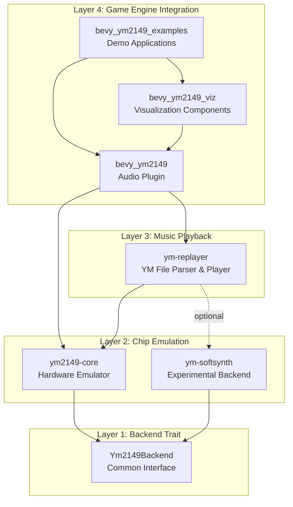
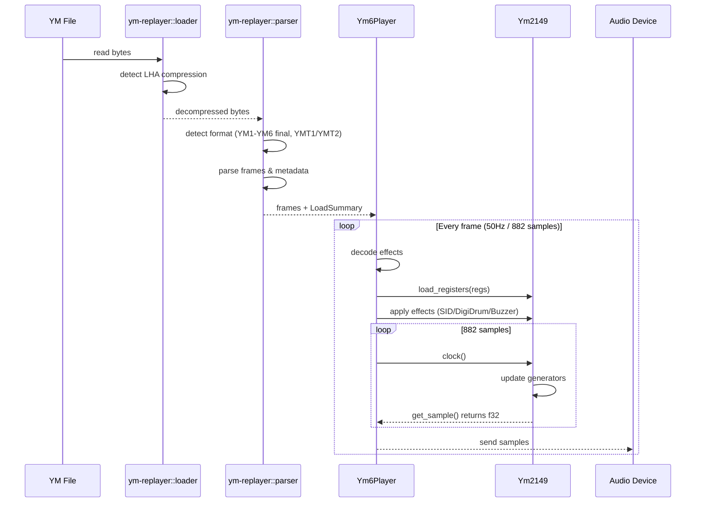
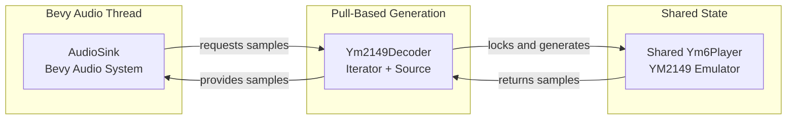

# YM2149-RS Workspace Architecture

Complete architecture documentation for the YM2149 emulation and playback toolkit.

## Overview

YM2149-RS is a modular Rust workspace providing cycle-accurate YM2149 PSG emulation, YM file playback, and Bevy game engine integration. The architecture follows strict separation of concerns with clear layer boundaries.

## Architectural Layers



## Crate Responsibilities

| Crate | Layer | Purpose | Public API | Binaries/Examples |
|-------|-------|---------|------------|-------------------|
| **ym2149-core** | 2 | Cycle-accurate YM2149 chip emulation | `Ym2149`, `Ym2149Backend` trait, streaming, visualization | `chip_demo` example |
| **ym-softsynth** | 2 | Experimental synthesizer backend | `SoftSynth` (implements `Ym2149Backend`) | None (library only) |
| **ym-replayer** | 3 | YM file parsing and playback | `Ym6Player`, `load_song()`, parsers, loader | `ym-replayer` CLI |
| **bevy_ym2149** | 4 | Bevy audio plugin with playback management | `Ym2149Plugin`, `Ym2149Playback` component | None (library only) |
| **bevy_ym2149_viz** | 4 | Visualization systems (scope, spectrum, UI) | Visualization components & systems | None (library only) |
| **bevy_ym2149_examples** | 4 | Runnable demo applications | None (examples only) | 5 example applications |

---

## Data Flow: YM File to Audio Output



---

## Layer 1: Backend Trait

### Purpose
Defines a common interface for all YM2149 chip implementations, enabling alternative backends.

### Trait Definition
```rust
pub trait Ym2149Backend: Send {
    fn new() -> Self where Self: Sized;
    fn with_clocks(master_clock: u32, sample_rate: u32) -> Self where Self: Sized;
    fn reset(&mut self);
    fn write_register(&mut self, addr: u8, value: u8);
    fn read_register(&self, addr: u8) -> u8;
    fn load_registers(&mut self, regs: &[u8; 16]);
    fn dump_registers(&self) -> [u8; 16];
    fn clock(&mut self);
    fn get_sample(&self) -> f32;
    fn generate_samples(&mut self, count: usize) -> Vec<f32>;
    fn get_channel_outputs(&self) -> (f32, f32, f32);
    fn set_channel_mute(&mut self, channel: usize, mute: bool);
    fn is_channel_muted(&self, channel: usize) -> bool;
    fn set_color_filter(&mut self, enabled: bool);
}
```

### Design Rationale
- **Send bound**: Enables multi-threaded audio pipelines
- **Associated types avoided**: Simple generic parameter for flexibility
- **Register-level API**: Matches hardware interface for accuracy
- **Sample-level control**: Allows precise timing control

---

## Layer 2: Chip Emulation

### ym2149-core

**Hardware-accurate emulation** of the YM2149 PSG chip.

**Architecture:**
```
Ym2149
├── 3x ToneGenerator (square wave, 12-bit frequency)
├── NoiseGenerator (17-bit LFSR)
├── EnvelopeGenerator (16 shapes, lookup table)
├── Mixer (AND gate logic, per-channel control)
└── ColorFilter (optional ST-style filtering)
```

**Key Features:**
- Fixed-point phase accumulators (16.16 format)
- Pre-computed envelope tables (16 shapes × 65K values)
- Zero allocations in hot path
- Hardware-specific methods for YM6 effects:
  - `set_mixer_overrides()` - For SID/Buzzer
  - `set_drum_sample_override()` - For DigiDrums
  - `trigger_envelope()` - For Sync Buzzer

**Performance:**
- ~1-2 µs per sample
- ~5% CPU @ 44.1 kHz sustained

**See:** [ym2149-core/ARCHITECTURE.md](crates/ym2149-core/ARCHITECTURE.md)

### ym-softsynth

**Experimental synthesizer** backend for non-critical applications.

**Status:** Work in progress, not production-ready

**Implements:** `Ym2149Backend` trait

**Provides:**
- Basic 3-channel tone generation
- Volume control
- Lightweight alternative to hardware emulation

**Limitations:**
- No envelope generator
- No noise generator
- No hardware effects
- Not cycle-accurate

**Use Cases:**
- Educational/prototyping
- Low-resource environments
- Simple PSG experimentation

**Note:** `SoftPlayer` has been disabled due to circular dependencies. Use `Ym6Player` with `SoftSynth` backend once generic backend support is implemented in ym-replayer.

---

## Streaming & Export Modules

### Where is Streaming?

**Location:** `ym2149-core/src/streaming/`

**Rationale:** Streaming (RingBuffer, AudioDevice, RealtimePlayer) is kept in ym2149-core because:
1. It's generic audio infrastructure, not YM-file-specific
2. Can be used for direct chip streaming without file parsing
3. Provides foundation for CLI player and standalone applications
4. **Note:** `bevy_ym2149` no longer uses these modules; it uses Bevy's native audio system instead

**Components:**
- `RingBuffer` - Lock-free circular buffer for producer/consumer threading
- `AudioDevice` - CPAL/rodio audio output wrapper
- `RealtimePlayer` - Real-time sample generation wrapper
- `StreamConfig` - Configuration for latency, sample rate, channels

**Usage:** Available via `ym2149::streaming::*` when `streaming` feature is enabled (used by CLI tools, not Bevy plugin).

### Audio Export

**Status:** ✅ **Implemented** - Available via feature flags

**Location:** `ym-replayer/src/export/`

**Supported Formats:**
- **WAV** - Uncompressed PCM audio (feature: `export-wav`)
- **MP3** - LAME-encoded compressed audio (feature: `export-mp3`)

**Features:**
- Configurable sample rate (default: 44,100 Hz)
- Mono/stereo output
- Optional audio normalization to prevent clipping
- Fade-out support with configurable duration
- Batch export capabilities

**Usage:**

Enable export features in `Cargo.toml`:
```toml
ym-replayer = { version = "0.6", features = ["export-wav"] }
# or
ym-replayer = { version = "0.6", features = ["export-mp3"] }
```

Example code:
```rust
use ym_replayer::{load_song, export::export_to_wav_default};

let data = std::fs::read("song.ym")?;
let (mut player, info) = load_song(&data)?;
export_to_wav_default(&mut player, info, "output.wav")?;
```

**Advanced Configuration:**
```rust
use ym_replayer::export::{export_to_mp3_with_config, ExportConfig};

let config = ExportConfig::stereo()
    .normalize(true)
    .fade_out(2.0); // 2-second fade out

export_to_mp3_with_config(&mut player, "output.mp3", info, 192, config)?;
```

**Implementation Notes:**
- WAV export uses pure Rust `hound` crate
- MP3 export uses `mp3lame-encoder` (requires LAME library)
- Both formats support custom `ExportConfig` for fine-grained control
- Export is synchronous - blocks until rendering completes

---

## Layer 3: Music Playback (ym-replayer)

### Responsibilities

1. **YM File Parsing**
   - Format detection (YM1/2/3/3b/4/5/6 final, YMT1/YMT2 tracker)
   - LHA decompression (automatic)
   - Frame extraction and de-interleaving
   - Metadata parsing

2. **Playback Orchestration**
   - Frame sequencing @ 50Hz VBL timing
   - Playback state management (Play/Pause/Stop)
   - Loop point handling
   - Sample generation coordination

3. **Effects & Profiles**
   - `FrameSequencer` owns register frames, loop points, and VBL timing
   - `FormatProfile` encapsulates YM2/YM5/YM6 quirks (register munging + effect decoding)
   - `EffectsPipeline` wraps the low-level `EffectsManager` and tracks SID/digidrum state
   - All format-specific logic now lives behind `FormatMode` strategies instead of `is_ym*_mode` flags

### Module Organization

```
ym-replayer/src/
├── parser/
│   ├── ym.rs              # YM1-YM5 parser
│   ├── ym6.rs             # YM6 (final format) parser
│   ├── effects.rs         # Effect command decoder
│   └── mod.rs             # FormatParser trait
├── compression/
│   └── mod.rs             # LHA decompression
├── loader/
│   └── mod.rs             # High-level file loading API
├── player/
│   ├── ym_player.rs       # Ym6PlayerGeneric<B> implementation
│   ├── effects_manager.rs # Effect state management
│   ├── effects_pipeline.rs# High-level effect wrapper (SID/DigiDrum state)
│   ├── format_profile.rs  # FormatMode trait & adapters (YM2/YM5/YM6)
│   ├── ym6/               # YM6 format types and helpers
│   │   ├── types.rs       # YmFileFormat, LoadSummary, Ym6Info
│   │   ├── helpers.rs     # Binary reading utilities
│   │   └── mod.rs
│   ├── vbl_sync.rs        # VBL timing helpers
│   ├── cycle_counter.rs   # Cycle-accurate counting
│   └── tracker_player.rs  # YMT tracker support
├── export/                # Audio export (feature-gated)
│   ├── wav.rs             # WAV export (feature: export-wav)
│   ├── mp3.rs             # MP3 export (feature: export-mp3)
│   └── mod.rs             # ExportConfig, normalize_samples, apply_fade_out
└── lib.rs                 # Public exports
```

### Playback Algorithm

```
initialize(ym_file):
  ├─ detect_format() → YM1/2/3/3b/4/5/6 (final), YMT1/YMT2
  ├─ decompress_if_needed() → raw bytes
  ├─ parse_frames() → Vec<[u8; 16]>
  ├─ parse_metadata() → title, author, etc.
  └─ create player(frames, metadata)

generate_samples(count):
  for each sample:
    if frame_position == 0:
      ├─ load current frame registers
      ├─ decode effects from registers
      └─ apply effects to chip

    chip.clock()
    sample = chip.get_sample()

    frame_position++
    if frame_position >= samples_per_frame:
      frame_position = 0
      current_frame++
      if current_frame >= total_frames:
        if loop_enabled:
          current_frame = loop_point
        else:
          stop()
```

### Generic Backend with Hardware-Specific Effects

**Implementation:** `Ym6Player` is implemented as a generic struct `Ym6PlayerGeneric<B: Ym2149Backend>`, allowing it to work with any backend that implements the `Ym2149Backend` trait.

**Type Alias:** The commonly-used `Ym6Player` is a type alias for the concrete hardware-accurate implementation:
```rust
pub type Ym6Player = Ym6PlayerGeneric<Ym2149>;
```

**Hardware Effects Support:** YM6 format includes special Atari ST hardware effects that require methods beyond the standard `Ym2149Backend` trait:
- `set_mixer_overrides()` - Used by SID voice and Sync Buzzer effects
- `set_drum_sample_override()` - Used by DigiDrum sample playback
- `trigger_envelope()` - Used by Sync Buzzer envelope restart

**Backend Compatibility:**
- `Ym2149` backend: ✅ Full YM6 effect support (hardware-accurate)
- `SoftSynth` backend: ⚠️ Can load YM6 files but effects are ignored (tone/noise/envelope only)
- Custom backends: Implement trait default methods (no-ops) to compile

**Design Rationale:** The trait provides default no-op implementations for hardware-specific methods, allowing generic code to compile while preserving effect functionality when using the concrete `Ym2149` type. This approach provides both flexibility (generic) and accuracy (hardware-specific features when needed).

---

## Layer 4: Bevy Integration

### bevy_ym2149

**Bevy ECS plugin** for YM2149 audio playback in games using Bevy's native audio system.

**Architecture:**
```
Ym2149Plugin
├── Asset System Integration
│   ├── Ym2149Loader (AssetLoader for .ym files)
│   ├── Ym2149AudioSource (Asset + Decodable)
│   └── Ym2149Decoder (Iterator + Source for sample generation)
├── Playback Management
│   ├── Ym2149Playback (component)
│   ├── PlaybackState (Playing/Paused/Stopped)
│   ├── AudioPlayer (Bevy's audio entity component)
│   └── AudioSink (play/pause/volume control)
├── Systems
│   ├── initialize_playback (spawns AudioPlayer entities)
│   ├── update_playback (controls AudioSink based on component state)
│   ├── audio_bridge_system (sample mirroring for custom DSP)
│   └── event_emission_system
└── Events
    ├── TrackStarted
    ├── TrackFinished
    └── ChannelSnapshot
```

**Key Features:**
- Native Bevy audio integration via `Decodable` trait
- On-demand sample generation (pull-based model)
- Automatic asset loading and caching
- ECS component-based playback management
- Playlist support with crossfading
- Audio bridge for custom DSP chains
- Diagnostics and metrics
- Event system for game logic integration

**Integration Points:**
```rust
App::new()
    .add_plugins(Ym2149Plugin::default())
    .add_systems(Startup, |mut commands: Commands| {
        commands.spawn(Ym2149Playback::new("music/song.ym"));
    })
```

**Audio Flow:**
```
Bevy Audio Thread (pull-based)
    ↓
AudioSink requests samples
    ↓
Ym2149Decoder::next() (Iterator trait)
    ↓
Ym6Player::generate_samples(882) [batch for efficiency]
    ↓
Ym2149::clock() × 882 [one VBL frame @ 50Hz]
    ↓
f32 samples returned to Bevy audio system
```

### bevy_ym2149_viz

**Visualization components** for YM2149 audio in Bevy applications.

**Components:**
- `Oscilloscope` - Real-time waveform display
- `SpectrumAnalyzer` - Frequency spectrum bars
- `ProgressBar` - Playback progress indicator
- `ChannelActivity` - Per-channel activity meters
- `VuMeter` - Volume level visualization

**Architecture:**
```
Ym2149VizPlugin
├── Oscilloscope System
│   ├── Buffer sampling
│   ├── Waveform rendering
│   └── UI integration
├── Spectrum System
│   ├── FFT processing
│   ├── Frequency bins
│   └── Bar rendering
└── UI Components
    ├── Progress tracking
    ├── Metadata display
    └── Channel status
```

### bevy_ym2149_examples

**Demo applications** showcasing features:

| Example | Features Demonstrated |
|---------|----------------------|
| `basic_example` | Simple playback, asset loading |
| `advanced_example` | Full UI, oscilloscope, spectrum, controls |
| `crossfade_example` | Playlist with smooth transitions |
| `feature_showcase` | Per-channel mute, diagnostics, events |
| `demoscene` | Visual effects synchronized to music |

---

## Cross-Layer Communication Patterns

### Pattern 1: Asset Loading (Bevy → Replayer → Core)

```
User spawns Ym2149Playback("song.ym")
    ↓
Bevy asset system detects .ym extension
    ↓
Ym2149Loader::load() (async)
    ↓
Read file bytes
    ↓
Ym2149AudioSource::new(data)
    ├─ ym_replayer::load_song(&data)
    ├─ Create Ym6Player with Ym2149 chip
    ├─ Call player.play() to start
    └─ Return Asset
    ↓
Asset added to Assets<Ym2149AudioSource> store
```

### Pattern 2: Audio Playback Initialization

```
initialize_playback system runs
    ↓
Detects Ym2149Playback without AudioPlayer
    ↓
Load Ym2149AudioSource from asset server
    ↓
Create AudioPlayer(audio_handle)
    ↓
Attach AudioPlayer + PlaybackSettings to entity
    ↓
Bevy audio system spawns audio thread
```

### Pattern 3: Sample Generation (Pull-Based, On-Demand)

```
Bevy Audio Thread needs samples
    ↓
Calls Ym2149Decoder::next() (Iterator trait)
    ↓
Decoder checks if buffer needs refill
    ↓
Ym6Player::generate_samples(882) [one VBL frame]
    ├─ For current frame:
    │   ├─ Load frame registers
    │   ├─ Decode effects
    │   └─ Apply effects to chip
    └─ For each of 882 samples:
        └─ Ym2149::clock() → f32
    ↓
Samples buffered in decoder
    ↓
Return single sample to Bevy
    ↓
Repeat until track ends or stopped
```

### Pattern 4: Effect Application (Replayer → Core)

```
Ym6Player decodes effect commands
    ↓
EffectsManager::update()
    ↓
Match effect type:
  ├─ SID → Ym2149::set_mixer_overrides()
  ├─ DigiDrum → Ym2149::set_drum_sample_override()
  └─ Buzzer → Ym2149::trigger_envelope()
```

---

## Dependency Graph

```
bevy_ym2149_examples
        │
        ├──→ bevy_ym2149_viz
        │           │
        │           └──→ bevy_ym2149
        │                       │
        └───────────────────────┴──→ ym-replayer
                                            │
                                            ├──→ ym2149-core
                                            │
                                            └──→ ym-softsynth (optional)
                                                        │
                                                        └──→ ym2149-core

ym-replayer-cli ──→ ym-replayer  # Standalone CLI binary with streaming/export
```

**Key Principles:**
- No circular dependencies
- Clear layer boundaries
- Optional features via Cargo features
- Minimal coupling between layers

---

## Threading Models

### CLI Streaming (Optional, Feature-Gated)

When `streaming` feature is enabled in CLI tools:


**Components:**
- `RingBuffer` - Lock-free circular buffer with atomic indices
- `RealtimePlayer` - Sample generation thread
- `AudioDevice` - CPAL audio output thread

**Latency:** ~120-150ms end-to-end (configurable buffer size)

**See:** [STREAMING_GUIDE.md](STREAMING_GUIDE.md)

### Bevy Integration (Native Audio System)

When using `bevy_ym2149`:



**Key Differences:**
- **Pull-based:** Audio thread requests samples on-demand (no ring buffer needed)
- **Bevy-managed:** Audio device lifecycle handled by Bevy
- **Asset integration:** YM files loaded via Bevy's asset system
- **Shared player:** `Arc<RwLock<Ym6Player>>` (using `parking_lot::RwLock`) allows concurrent read access for audio thread and visualization systems with reduced lock contention
- **Lower latency:** No intermediate buffer, direct sample generation

### Why RwLock Instead of Mutex?

**Decision:** Use `parking_lot::RwLock<Ym6Player>` instead of `Mutex<Ym6Player>`

**Rationale:**
- **Multiple readers:** RwLock allows many concurrent readers (diagnostics, visualization, UI systems)
- **Single writer:** Only audio decoder needs write access via `.write()` for `generate_samples()`
- **Reduced contention:** Visualization systems can query player state without blocking audio thread
- **Explicit intent:** `.read()` vs `.write()` makes access patterns clear in code

**Usage Pattern:**
```rust
// Concurrent reads (visualization, diagnostics)
let player = player_arc.read();
let frame = player.get_current_frame();
let title = player.info().map(|i| &i.song_name);

// Exclusive write (audio generation only)
let mut player = player_arc.write();
let samples = player.generate_samples(882);
```

**Performance Benefit:** In crossfade scenarios with two simultaneous players plus visualization, RwLock prevents unnecessary blocking when multiple systems need read-only access.

---

## Feature Flag Matrix

| Feature | ym2149-core | ym-replayer | bevy_ym2149 | Notes |
|---------|-------------|-------------|-------------|-------|
| `emulator` | ✓ (default) | - | - | Core chip emulation |
| `streaming` | ✓ | ✓ | - | CLI streaming only; Bevy uses native audio |
| `visualization` | ✓ | - | - | Terminal UI helpers |
| `effects` | - | ✓ (default) | - | YM6 effects support |
| `tracker` | - | ✓ (default) | - | YMT tracker support |
| `digidrums` | - | ✓ (default) | - | Mad Max digi-drums |
| `softsynth` | - | ✓ (optional) | - | Experimental synthesizer backend |
| `export-wav` | - | ✓ (optional) | - | WAV file export (uses `hound`) |
| `export-mp3` | - | ✓ (optional) | - | MP3 file export (requires LAME) |

---

## Performance Characteristics

### Memory Footprint

| Component | Memory Usage |
|-----------|--------------|
| Ym2149 chip instance | ~1 KB |
| Ym6Player (3-minute song) | ~1-2 MB (frames) |
| RingBuffer (16KB) | 16 KB |
| Bevy playback component | ~2 KB + player |

### CPU Usage (44.1 kHz)

| Operation | Time | CPU % |
|-----------|------|-------|
| Ym2149::clock() | 1-2 µs | 5% (sustained) |
| Effect processing | 0.2-0.5 µs | included |
| Frame loading | ~10 µs | negligible |
| Total playback | ~45-90 ms/sec | 5-10% |

---

## Migration from v0.5 to v0.6

### Breaking Changes
Code using deprecated modules must update imports:

```rust
// v0.5 (deprecated but still works)
use ym2149::replayer::Ym6Player;
use ym2149::ym_loader;

// v0.6 (recommended)
use ym_replayer::Ym6Player;
use ym_replayer::loader;
```

### Backward Compatibility
Old paths emit deprecation warnings with migration guidance. All deprecated code remains functional in v0.6.

---

## Testing Strategy

### Unit Tests
- **ym2149-core:** Chip component tests (generators, mixer, registers)
- **ym-replayer:** Parser tests, effect decoding, playback logic
- **bevy_ym2149:** System tests, component lifecycle

### Integration Tests
- **ym-replayer:** Full file loading and playback
- **bevy_ym2149:** Asset loading, playback coordination

### Current Status
**165+ tests passing** across workspace

```bash
cargo test --workspace
```

---

## Design Principles

1. **Separation of Concerns**
   - Chip emulation independent of file formats
   - Playback independent of UI/game engine
   - Clear layer boundaries

2. **Backend Abstraction**
   - `Ym2149Backend` trait for alternative implementations
   - Effects use hardware-specific methods when needed
   - Balance between generics and pragmatism

3. **Zero-Cost Abstractions**
   - No allocations in sample generation hot path
   - Inline-friendly design
   - Fixed-point math for precision without overhead

4. **Modular Features**
   - Optional dependencies via Cargo features
   - Minimal default footprint
   - Pay only for what you use

5. **Idiomatic Rust**
   - Strong typing for safety
   - Ownership for zero-copy
   - Traits for extensibility
   - Atomics for lock-free concurrency

---

## Related Documentation

- [ym2149-core Architecture](crates/ym2149-core/ARCHITECTURE.md) - Chip emulation details
- [Streaming Guide](STREAMING_GUIDE.md) - Real-time audio architecture
- [ym-replayer README](crates/ym-replayer/README.md) - Playback layer API
- [bevy_ym2149 README](crates/bevy_ym2149/README.md) - Bevy integration guide

---

## Future Considerations

### Potential Enhancements
- WASM support for web playback
- Additional backends (e.g., FPGA cores)
- YM7 format support
- MIDI export capabilities
- Advanced DSP effects

### Architectural Stability
The current layer separation provides a stable foundation for these enhancements without requiring major refactoring.
