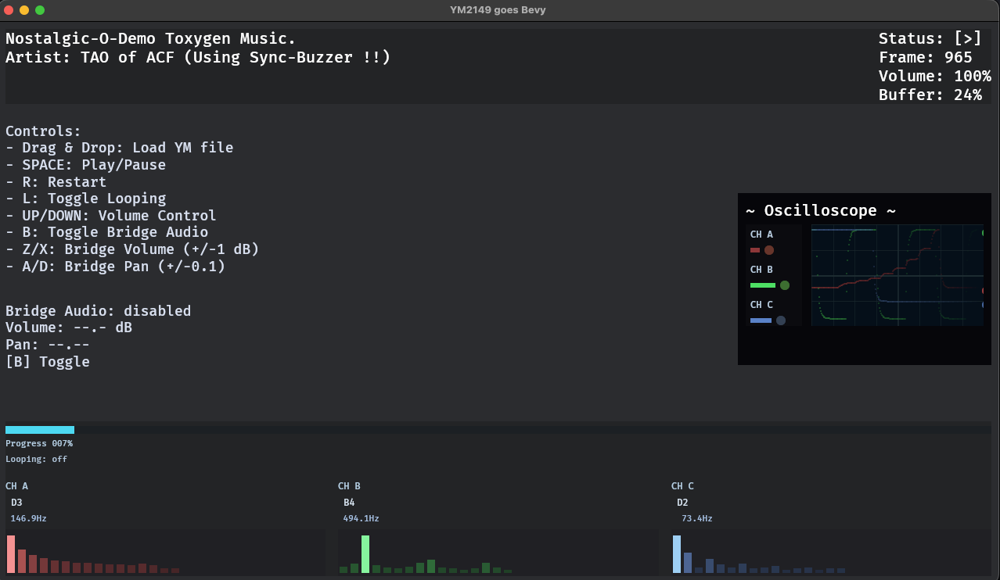
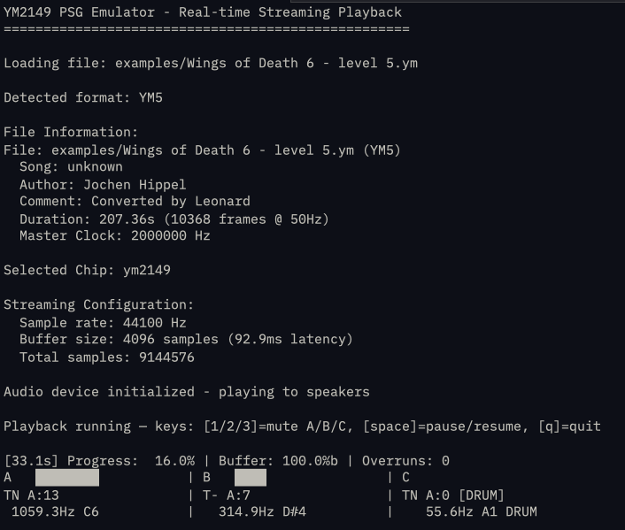

# YM2149-RS

**The most complete YM2149/AY-3-8910 ecosystem in Rust.**

[](LICENSE)

## What is the YM2149?

The **Yamaha YM2149** (and its compatible sibling, the General Instrument **AY-3-8910**) is a **Programmable Sound Generator (PSG)** — a dedicated audio chip that defined the sound of an entire computing era.

**Three square-wave channels. One noise generator. Hardware envelopes. Pure 8-bit/16-bit retro soul.**

If you've ever heard music from an **Atari ST**, **Amstrad CPC**, **ZX Spectrum 128**, **MSX**, or countless arcade machines from the 1980s/90s, you've heard this chip. It powered everything from game soundtracks to the legendary European demoscene, where programmers pushed (and still push) these simple waveforms to create surprisingly complex and powerful music.

The YM2149 doesn't do wavetables or samples (mostly). It doesn't do FM synthesis. What it does is generate raw, characterful square waves with programmable frequencies, a shared noise source, and distinctive hardware envelopes — all mixed through a logarithmic DAC that gives it that unmistakable warm, buzzy, *chiptune* sound.

**This crate brings that sound to Rust** — cycle-accurate, format-complete, and ready for your emulator, game, or nostalgia project.

## Why YM2149-RS?

**For Demoscene Enthusiasts & Chiptune Artists:**
Play back your entire collection of YM, SNDH, AY, and Arkos Tracker files with authentic sound reproduction — in the terminal, browser, or your next retro-inspired game.

**For Game Developers:**
Drop authentic PSG audio into Bevy games with a single plugin. Playlists, crossfades, visualizations, and audio-reactive gameplay hooks included.

**For Emulator Authors:**
A clean, well-tested YM2149 core with configurable backends. Integrate the chip into your Atari ST, CPC, or custom system emulator.

**For the Curious:**
Explore how classic sound chips work. The codebase is documented, tested, and designed to be readable.

### What Makes This Special

| Feature | Description |
|---------|-------------|
| **Cycle-Accurate Core** | Precise emulation of all PSG features — envelopes, noise, mixer, SID voice, Sync Buzzer, and digi-drum effects |
| **Multi-PSG Emulation** | Run multiple YM2149 chips in parallel — natively supported via Arkos Tracker format for authentic dual/triple-chip music |
| **Seven Format Replayers** | YM (1-6), YMT1/YMT2, GIST (.snd), Arkos Tracker (.aks), ZXAY/EMUL (.ay), and SNDH with full 68000 CPU emulation |
| **Zero-Compromise Bevy Integration** | Not a wrapper around C code — pure Rust from chip to speaker |
| **Runs Everywhere** | CLI, native apps, WASM browser player, Bevy games — same codebase |
| **Production-Ready** | 165+ tests, documented APIs, real-world demoscene fixtures |

---

| Crate | crates.io | docs.rs |
|-------|-----------|---------|
| `ym2149` | [](https://crates.io/crates/ym2149) | [](https://docs.rs/ym2149) |
| `ym2149-common` | [](https://crates.io/crates/ym2149-common) | [](https://docs.rs/ym2149-common) |
| `ym2149-ym-replayer` | [](https://crates.io/crates/ym2149-ym-replayer) | [](https://docs.rs/ym2149-ym-replayer) |
| `ym2149-arkos-replayer` | [](https://crates.io/crates/ym2149-arkos-replayer) | [](https://docs.rs/ym2149-arkos-replayer) |
| `ym2149-ay-replayer` | [](https://crates.io/crates/ym2149-ay-replayer) | [](https://docs.rs/ym2149-ay-replayer) |
| `ym2149-sndh-replayer` | [](https://crates.io/crates/ym2149-sndh-replayer) | [](https://docs.rs/ym2149-sndh-replayer) |
| `ym2149-gist-replayer` | [](https://crates.io/crates/ym2149-gist-replayer) | [](https://docs.rs/ym2149-gist-replayer) |
| `bevy_ym2149` | [](https://crates.io/crates/bevy_ym2149) | [](https://docs.rs/bevy_ym2149) |
| `bevy_ym2149_viz` | [](https://crates.io/crates/bevy_ym2149_viz) | [](https://docs.rs/bevy_ym2149_viz) |
| `ym2149-bevy` | [](https://crates.io/crates/ym2149-bevy) | – |

> Cycle-accurate Yamaha YM2149 tooling for Rust — from raw PSG emulation and YM/YMT/SNDH importers to Arkos Tracker playback, CLI/export pipelines, Bevy integrations, visualization stacks, and a one-click WASM demo.

| Quick Links | |
|-------------|---|
| ▶️ [Web Player](https://slippyex.github.io/ym2149-rs/) | Cycle-accurate YM/AKS demo in the browser |
| 🧱 [Architecture](ARCHITECTURE.md) | Layered breakdown of emulator, replayers, and integrations |
| 🧭 [Quick Start](#quick-start) | Code snippets for core, CLI, Bevy, and exports |
| 🆕 [Changelog](CHANGELOG.md) | Recent features and compatibility notes |

## At a Glance

| 🧠 Core Emulator | 🪕 Audio Pipelines | 🕹️ Game & Bevy |
|------------------|-------------------|----------------|
| Integer-accurate PSG, YM1–YM6 & tracker helpers | Streaming playback, WAV export, playlist automation | Plug-and-play Bevy plugins with diagnostics, viz, playlists |
| 🌐 Browser Ready | 📦 Monorepo Cohesion | 🧪 Quality |
| WASM player (147 KB) with LHA support & drag-drop | Shared versioning, unified docs, cross-crate tests | 165+ tests, curated fixtures, demoscene examples |


## 🎵 Try it in Your Browser

**[► Launch Web Player](https://slippyex.github.io/ym2149-rs/)**

Experience authentic Atari ST chiptune music directly in your browser! The WebAssembly player features:
- ✨ Full YM2-YM6 and SNDH format support with LHA/ICE decompression
- 🎮 Play/Pause/Stop controls with progress bar
- 🔊 Volume control and channel muting (A/B/C)
- 📊 Real-time metadata display
- 📦 Compact WASM module
- 🎯 Cycle-accurate YM2149 emulation (ported from Leonard/Oxygene's AtariAudio)

<details>
<summary>📸 Web Player Preview</summary>

Try it live: **[slippyex.github.io/ym2149-rs](https://slippyex.github.io/ym2149-rs/)**

*Retro CRT-style interface with drag & drop file loading*
</details>

## Workspace Packages

| Crate | Purpose | Crates.io | Docs |
|-------|---------|-----------|------|
| [`ym2149`](crates/ym2149-core) | Core YM2149 chip emulator (cycle-accurate) | [crates.io/crates/ym2149](https://crates.io/crates/ym2149) | [docs.rs/ym2149](https://docs.rs/ym2149) |
| [`ym2149-common`](crates/ym2149-common) | Shared traits (`ChiptunePlayer`, `PlaybackMetadata`) and types | [crates.io/crates/ym2149-common](https://crates.io/crates/ym2149-common) | [docs.rs/ym2149-common](https://docs.rs/ym2149-common) |
| [`ym2149-ym-replayer`](crates/ym2149-ym-replayer) | YM file parsing and music playback (YM1-YM6, YMT1/YMT2 tracker) | [crates.io/crates/ym2149-ym-replayer](https://crates.io/crates/ym2149-ym-replayer) | [docs.rs/ym2149-ym-replayer](https://docs.rs/ym2149-ym-replayer) |
| [`ym2149-replayer-cli`](crates/ym2149-replayer-cli) | Standalone CLI player with streaming and export | Unpublished (workspace) | – |
| [`ym2149-softsynth`](crates/ym2149-softsynth) | Experimental software synthesizer backend (proof-of-concept) | Unpublished (workspace) | [crates/ym2149-softsynth/README.md](crates/ym2149-softsynth/README.md) |
| [`ym2149-arkos-replayer`](crates/ym2149-arkos-replayer) | Arkos Tracker 2/3 (.aks) parser and native multi-PSG player (pure Rust) | [crates.io/crates/ym2149-arkos-replayer](https://crates.io/crates/ym2149-arkos-replayer) | [docs.rs/ym2149-arkos-replayer](https://docs.rs/ym2149-arkos-replayer) |
| [`ym2149-ay-replayer`](crates/ym2149-ay-replayer) | ZXAY/EMUL AY file parser with integrated Z80 replayer | [crates.io/crates/ym2149-ay-replayer](https://crates.io/crates/ym2149-ay-replayer) | [docs.rs/ym2149-ay-replayer](https://docs.rs/ym2149-ay-replayer) |
| [`ym2149-sndh-replayer`](crates/ym2149-sndh-replayer) | SNDH (Atari ST) player with 68000 CPU + MFP timer + STE DAC emulation | [crates.io/crates/ym2149-sndh-replayer](https://crates.io/crates/ym2149-sndh-replayer) | [docs.rs/ym2149-sndh-replayer](https://docs.rs/ym2149-sndh-replayer) |
| [`ym2149-gist-replayer`](crates/ym2149-gist-replayer) | GIST sound effect parser and multi-voice player (Atari ST) | [crates.io/crates/ym2149-gist-replayer](https://crates.io/crates/ym2149-gist-replayer) | [docs.rs/ym2149-gist-replayer](https://docs.rs/ym2149-gist-replayer) |
| [`bevy_ym2149`](crates/bevy_ym2149) | Bevy audio plugin (playback, playlists, diagnostics, audio bridge) | [crates.io/crates/bevy_ym2149](https://crates.io/crates/bevy_ym2149) | [docs.rs/bevy_ym2149](https://docs.rs/bevy_ym2149) |
| [`bevy_ym2149_viz`](crates/bevy_ym2149_viz) | Optional visualization systems & UI builders | [crates.io/crates/bevy_ym2149_viz](https://crates.io/crates/bevy_ym2149_viz) | [docs.rs/bevy_ym2149_viz](https://docs.rs/bevy_ym2149_viz) |
| [`bevy_ym2149_examples`](crates/bevy_ym2149_examples) | Runnable Bevy demos (basic, advanced, crossfade, feature showcase, demoscene, playlist UI) | Workspace-only | [crates/bevy_ym2149_examples/README.md](crates/bevy_ym2149_examples/README.md) |
| [`ym2149-wasm`](crates/ym2149-wasm) | WebAssembly bindings for browser playback ([web demo](https://slippyex.github.io/ym2149-rs/)) | Workspace-only | [crates/ym2149-wasm/README.md](crates/ym2149-wasm/README.md) |
| [`ym2149-bevy`](crates/ym2149-bevy) | Legacy re-export (shim to `bevy_ym2149`) | [crates.io/crates/ym2149-bevy](https://crates.io/crates/ym2149-bevy) | – |

Naming: Bevy-focused crates follow `bevy_ym2149_*`, while core/backends/replayers use the `ym2149-*` prefix.



## Highlights

- ✅ **Hardware-faithful**: cycle-accurate YM2149 emulation (ported from Leonard/Oxygene's AtariAudio), precise envelope, noise, mixer, SID, Sync Buzzer, digi-drum behaviours
- 📁 **ZXAY/EMUL AY**: bundled replayer with Z80 CPU emulation for the Project AY catalogue
- 🎹 **SNDH support**: native Atari ST music via 68000 CPU + MFP 68901 timer + STE DAC emulation
- 🧰 **CLI ready**: stream YM/AKS/AY/SNDH files in the terminal with real-time visualization
- 🎵 **Native Bevy audio**: seamless integration via `Decodable` trait with pull-based sample generation
- 🛰️ **Configurable Bevy subsystems**: playlists, crossfade decks, music state graphs, channel events, diagnostics, audio bridge
- 🖼️ **Visualization stack**: drop-in oscilloscope, spectrum bars, progress HUD, and demoscene showcase based on the viz crate
- 🧪 **Well-tested**: `cargo test --workspace` (165+ tests) plus example scenes to validate runtime flows
- 🪄 **Gameplay hooks**: Bevy plugin ships marker events, audio-reactive metrics, and PSG one-shot SFX events

### Why Arkos Tracker Support?

Arkos Tracker is the de-facto “modern” workflow for YM2149/AY musicians: it blends a classic step-sequencer with a visual instrument designer, supports multiple PSGs per song, and lets composers mix hardware envelopes with software macros. Native support matters because:

- **Multi-PSG music** – Arkos sequences can target two or more AY chips; our replayer handles that natively, both in the CLI and Bevy.
- **Modern authoring tools** – Musicians can stay in the Arkos editor (PC/Mac) and drop the `.aks` export straight into any crate in this repo—no external tracker runtime or C++ bridge required.
- **Feature parity** – Hardware effects (Sync Buzzer, DigiDrum, SID), custom arps, and per-channel envelopes all map to the same PSG core shared with YM/AY playback.
- **Cross-target builds** – The same Rust replayer powers desktop, web (WASM), and Bevy integrations, so Arkos rips behave identically everywhere.

In short: Arkos lets artists work with modern ergonomics, and this workspace lets those songs run anywhere Rust does.

## Quick Start

### Use the Core Library

```toml
[dependencies]
# Core emulator only (minimal dependencies)
ym2149 = "0.7"

# With streaming audio output
ym2149 = { version = "0.7", features = ["streaming"] }

# YM file parsing and playback
ym2149-ym-replayer = "0.7"
```

```rust
use ym2149_ym_replayer::{load_song, ChiptunePlayer, ChiptunePlayerBase, PlaybackMetadata};

fn main() -> anyhow::Result<()> {
    let data = std::fs::read("song.ym")?;
    let (mut player, summary) = load_song(&data)?;

    // Use the unified ChiptunePlayerBase interface for playback
    player.play();
    let samples = player.generate_samples(summary.samples_per_frame as usize);

    // Access metadata via ChiptunePlayer trait (extends ChiptunePlayerBase)
    let meta = player.metadata();
    println!("{} by {} • {} frames", meta.title(), meta.author(), summary.frame_count);
    Ok(())
}
```

### Run the CLI Player

```bash
# Real-time playback with scope overlay
cargo run -p ym2149-replayer-cli -- examples/ym/ND-Toxygene.ym

# Play SNDH files from the Atari ST demoscene
cargo run -p ym2149-replayer-cli -- examples/sndh/Mad_Max/Buzzer.sndh

# Play GIST sound effects (.snd)
cargo run -p ym2149-gist-replayer --example player -- examples/gist/alien.snd

# Interactive demo with Bevy visualization
cargo run -p bevy_ym2149_examples --example basic_example
```



### Export to Audio Files

```rust
use ym2149_ym_replayer::{load_song, export::export_to_wav_default, export::ExportConfig};

fn main() -> anyhow::Result<()> {
    let data = std::fs::read("song.ym")?;
    let (mut player, info) = load_song(&data)?;

    // Export to WAV (feature: export-wav)
    export_to_wav_default(&mut player, info, "output.wav")?;

    Ok(())
}
```

> Note: MP3 export was removed because the system-dependent LAME/Autotools toolchain proved too brittle. Export WAV instead and transcode externally (e.g. `ffmpeg -i output.wav -b:a 192k output.mp3`).

### Add the Bevy Plugin

```rust
use bevy::prelude::*;
use bevy_ym2149::{Ym2149Playback, Ym2149Plugin};
use bevy_ym2149_viz::Ym2149VizPlugin;

fn main() {
    App::new()
        .add_plugins((DefaultPlugins, Ym2149Plugin::default(), Ym2149VizPlugin::default()))
        .add_systems(Startup, |mut commands: Commands| {
            commands.spawn(Camera2d);
            commands.spawn(Ym2149Playback::new("assets/music/song.ym")).insert(Name::new("Tracker"));
        })
        .run();
}
```

Need a reference scene? `cargo run --example advanced_example -p bevy_ym2149_examples`.
Want to try the browser demo? Open https://slippyex.github.io/ym2149-rs/web/simple-player.html (auto-built via GitHub Pages).

## Where to Find Music Files

Looking for chiptunes to play? These community archives have thousands of tracks:

| Archive | Format | Description |
|---------|--------|-------------|
| [SNDH Archive](https://sndh.atari.org/) | `.sndh` | The definitive Atari ST music collection — demoscene classics, game soundtracks, and more |
| [ST-Sound / Leonard](https://pacidemo.planet-d.net/aldn/index.html) | `.ym` | Curated YM archive by Leonard/Oxygene with high-quality rips |
| [Project AY](https://worldofspectrum.org/projectay/gdmusic.htm) | `.ay` | ZX Spectrum and Amstrad CPC music archive |
| [Arkos Tracker 3](https://bitbucket.org/JulienNevo/arkostracker3/src/master/) | `.aks` | Source repository with example songs and the tracker itself |

## Documentation & Guides

- `crates/ym2149-core/README.md` – emulator architecture, feature flags, CLI/export instructions
- `crates/bevy_ym2149/README.md` – plugin subsystems, playlists, music state graph, audio bridge, diagnostics
- `crates/bevy_ym2149_viz/README.md` – visualization builders and systems
- `crates/bevy_ym2149_examples/README.md` – example matrix + screenshot gallery (incl. playlist crossfade UI)
- [ARCHITECTURE.md](ARCHITECTURE.md) – YM + Arkos playback pipelines and layering details
- [crates/ym2149-core/STREAMING_GUIDE.md](crates/ym2149-core/STREAMING_GUIDE.md) – low-latency streaming details
- `examples/` – curated list of `.ym`,`.aks`, `.ay`, and `.sndh` files for regression tests and the wasm demo

Need to refresh the wasm demo bundle? Run `scripts/build-wasm-examples.sh`
from the repo root to rebuild via `wasm-pack` and copy the output into
`crates/ym2149-wasm/examples/pkg/`.

## Testing

```bash
# Entire workspace
cargo test --workspace

# Focus a crate
cargo test -p ym2149
cargo test -p bevy_ym2149

# Feature-specific tests
cargo test -p ym2149 --features streaming
```

## Development Prerequisites

- Rust 1.83+ (Rust 2024 edition) with `cargo` and `rustfmt`
- Audio backend libraries for CPAL/Rodio (ALSA/PulseAudio, CoreAudio, WASAPI, etc.) when testing real-time playback
- AY playback: ZX-only, firmware calls are unsupported (CPC/ROM-heavy AY files will be rejected)
- Optional tooling:
  - [`wasm-pack`](https://rustwasm.github.io/wasm-pack/) for building the web player
  - `node`/`npm` or `python -m http.server` for serving the WASM demo locally
  - Bevy’s native dependencies (Vulkan/Metal/DX) when running the example scenes
  - `cargo-make`/`just` if you use the provided helper scripts (optional)

## Project Structure

```
ym2149-rs/
├── crates/
│   ├── ym2149-core/            # Core YM2149 chip emulator (crates.io `ym2149`)
│   ├── ym2149-common/          # Shared traits (ChiptunePlayer, PlaybackMetadata) and types
│   ├── ym2149-softsynth/       # Experimental soft synth backend implementing the backend trait
│   ├── ym2149-ym-replayer/     # YM parser + playback engine
│   ├── ym2149-arkos-replayer/  # Arkos Tracker (.aks) parser/player
│   ├── ym2149-ay-replayer/     # ZXAY/EMUL parser + Z80 runner (ZX-only; CPC AY rejected)
│   ├── ym2149-sndh-replayer/   # SNDH player with 68000 CPU + MFP timer + STE DAC emulation
│   ├── ym2149-gist-replayer/   # GIST sound effect parser and multi-voice player
│   ├── ym2149-replayer-cli/    # Terminal streamer/exporter built on the replayers
│   ├── ym2149-wasm/            # WASM bindings + browser demo
│   ├── bevy_ym2149/            # Bevy plugin (playback, playlists, crossfade, diagnostics)
│   ├── bevy_ym2149_viz/        # Optional visualization ECS systems
│   ├── bevy_ym2149_examples/   # Runnable Bevy app gallery
│   └── ym2149-bevy/            # Legacy shim that re-exports `bevy_ym2149`
├── examples/                   # YM/SNDH sample files
├── docs/                       # Web player (GitHub Pages)
├── Cargo.toml                  # Workspace configuration
└── README.md                   # You are here
```

### Deploying the Web Player

The web player is automatically deployed to GitHub Pages via CI/CD:

1. **Enable GitHub Pages** in your repository settings:
   - Go to Settings → Pages
   - Source: "GitHub Actions"

2. **Push to main/master** - the workflow will:
   - Build WASM with `wasm-pack`
   - Copy files to `docs/`
   - Deploy to GitHub Pages

3. **Local testing**:
   ```bash
   cd crates/ym2149-wasm/examples
   ./start-server.sh
   # Open http://localhost:8000/
   ```

## Contributing

Contributions are welcome! Please ensure:
- `cargo fmt` + `cargo clippy`
- `cargo test --workspace`
- Documentation and examples updated for new features

## License

MIT License – see [LICENSE](LICENSE).

## Credits

- **Leonard/Oxygene (Arnaud Carré)** – YM format specification, ST-Sound reference material, and the AtariAudio C++ implementation that forms the basis of our YM2149 core emulation
- **Atari ST + demoscene community** – for the original tunes, SNDH archive, and documentation
- **Rust audio and Bevy ecosystems** – rodio/cpal, Bevy ECS, and community inspiration
