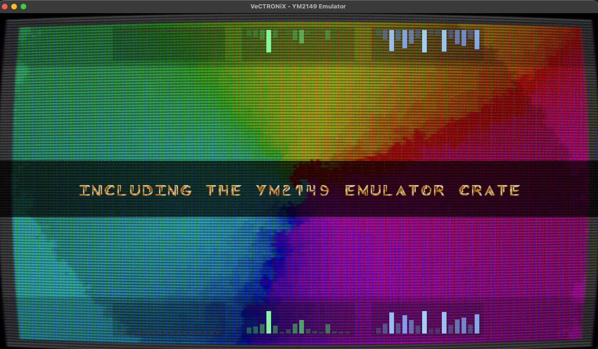
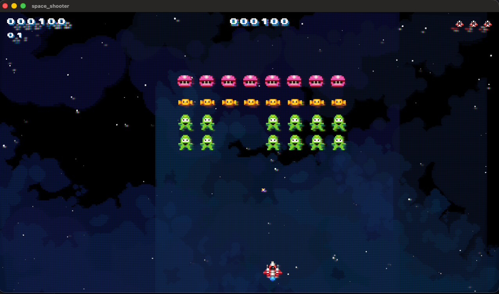

# bevy_ym2149_examples

Example applications demonstrating the bevy_ym2149 plugin.

This crate contains comprehensive runnable examples showing how to use the YM2149 PSG emulator plugin in Bevy applications, from basic playback to advanced visualization and audio routing.

**Supported formats:**
- **YM** - Compressed register dumps (Atari ST, Amstrad CPC, ZX Spectrum)
- **SNDH** - Atari ST music with 68000 CPU emulation
- **AKS** - Arkos Tracker 2 format
- **AY** - ZX Spectrum format
- **GIST** - Atari ST sound effects (112-byte register sequences)

## Example Matrix

| Example | Highlights |
|---------|------------|
| `basic_example` | Minimal playback & keyboard controls |
| `crossfade_example` | Dual-deck playlist with seamless crossfades |
| `advanced_example` | Tracker UI, oscilloscope, drag-and-drop, audio bridge |
| `feature_showcase` | Multiple playbacks, playlists, music states, diagnostics |
| `demoscene` | Shader-heavy CRT pipeline + synchronized overlays |
| `playlist_crossfade_example` | Selectable playlist UI with crossfades |
| `sndh_with_gist_sfx` | Dual YM2149 emulators: SNDH music + GIST sound effects |
| `space_shooter` | Complete arcade game: CRT, power-ups, high scores, attract mode |

## Examples

### basic_example
Minimal example showing:
- Creating a Bevy app with the YM2149 plugin
- Loading and playing a YM file
- Basic keyboard controls (Play/Pause, Restart, Volume)

**Run:** `cargo run --example basic_example -p bevy_ym2149_examples`

### crossfade_example
Focused demonstration of the playlist crossfade feature:
- Builds a two-track playlist from bundled assets
- Uses `CrossfadeConfig::start_at_seconds(15.0).with_window_seconds(15.0)` so a new deck fades in every 15s while the overlap window lasts 15s
- Loops indefinitely so you can hear the recurring blend cadence

**Run:** `cargo run --example crossfade_example -p bevy_ym2149_examples`

### playlist_crossfade_example
Selectable playlist UI with manual crossfades:
- Reads all bundled songs in `assets/music`, displays title/author plus filename
- Arrow Up/Down to select, `Enter` starts a 5s crossfade to the highlighted song, `Esc` quits
- Highlights the currently playing entry while fading so you always see the active deck

**Run:** `cargo run --example playlist_crossfade_example -p bevy_ym2149_examples`

### advanced_example
Advanced features including:
- Real-time visualization (oscilloscope, channel display, spectrum analysis)
- File drag-and-drop loading
- Audio bridge mixing with volume and pan controls
- Keyboard-based playback control
- Optional frame-derived BPM indicator (helper available in code comments/snippets)

**Run:** `cargo run --example advanced_example -p bevy_ym2149_examples`


### feature_showcase
Comprehensive demonstration of:
- Multiple simultaneous YM file playbacks
- Playlist management with automatic progression
- Music state graphs for dynamic music transitions
- Audio bridge mixing with real-time parameter control
- Playback diagnostics and frame position tracking
- Event-driven architecture for track transitions

**Run:** `cargo run --example feature_showcase -p bevy_ym2149_examples`

### demoscene
Demoscene-style example featuring:
- YM2149 music playback synchronized with visuals
- Bitmap font rendering with multiple animated overlay modes (Typewriter, BounceIn, CascadeZoom, etc.)
- Responsive layout with swing/breathing motion and DPI-aware scaling
- Dual-pass WGSL pipeline: raymarched scene + CRT post-process shader (toggle with `C`)
- Fullscreen / Windowed mode switching (toggle with `F`)
- Easing functions for text animation timing and shader sequencing

**Run:** `cargo run --example demoscene -p bevy_ym2149_examples`



**Controls**
- `C` – Toggle CRT post-processing (single-pass scene vs. CRT overlay)
- `F` - Toggle fullscreen mode
- `Esc` – Exit the application

### sndh_with_gist_sfx
Dual YM2149 emulator example demonstrating:
- **Background music:** SNDH file playback via `Ym2149Playback` (68000 CPU emulation)
- **Sound effects:** Separate `GistPlayer` instance for GIST .snd files
- **Independent audio streams:** Music and SFX run on separate YM2149 emulators, mixed by Bevy's audio system
- **Keyboard-triggered SFX:** Keys 1-9 trigger different sound effects (laser, explosion, gunshot, etc.)

This demonstrates a common game audio pattern: background music on one chip, sound effects on another — just like arcade cabinets with multiple sound chips.

**Run:** `cargo run --example sndh_with_gist_sfx -p bevy_ym2149_examples`

**Controls**
- `1-9` – Trigger GIST sound effects
- `SPACE` – Play/Pause music
- `R` – Restart music
- `UP/DOWN` – Volume control

**Architecture:**
```rust
// Music: via bevy_ym2149 plugin (handles SNDH/68000 emulation)
let asset_handle = asset_server.load("music/Wings_Of_Death.sndh");
commands.spawn(Ym2149Playback::from_asset(asset_handle));

// SFX: standalone GistPlayer with custom Bevy audio source
let gist_player = Arc::new(Mutex::new(GistPlayer::new()));
// ... register as Bevy Decodable audio source
```

### space_shooter
Galaxian-style retro arcade game demonstrating:
- **SNDH music:** Mad Max's "Lethal Xcess (STe)" soundtrack with subsong crossfades (title, gameplay, game over)
- **GIST sound effects:** Laser, explosion, death, and power-up sounds on separate YM2149 emulator
- **CRT post-processing:** Toggleable scanline/bloom shader effect
- **Sprite-based UI:** Life icons, score digits, wave counter using sprite sheets
- **Power-up system:** Rapid Fire, Triple Shot, Speed Boost, Power Shot with animated pickups
- **High score persistence:** Top 10 scores saved to disk with 3-character name entry
- **Visual effects:** Screen shake, score popups, invincibility shield bubble, death flash
- **Attract mode:** Auto-cycling title screen → high scores → power-ups info → enemy scores
- **Enemy waves:** Formation movement with diving attack patterns, increasing difficulty

**Run:** `cargo run --example space_shooter -p bevy_ym2149_examples --release`



**Controls**
| Screen | Key | Action |
|--------|-----|--------|
| Title | `Enter` | Start game |
| Title | `H` | View high scores |
| Title | `Esc` | Quit |
| Gameplay | `←/→` | Move ship |
| Gameplay | `Space` | Fire |
| Gameplay | `M` | Toggle music |
| Gameplay | `C` | Toggle CRT effect |
| Gameplay | `Q` | Quit (with confirmation) |
| Gameplay | `R` | Restart |
| Name Entry | `↑/↓` | Change letter |
| Name Entry | `←/→` | Move cursor |
| Name Entry | `Enter` | Confirm name |

**CLI Options**
```bash
# Disable music
cargo run --example space_shooter -p bevy_ym2149_examples --release -- -m false

# Reset high scores to defaults
cargo run --example space_shooter -p bevy_ym2149_examples --release -- --reset-hi-scores
```

## Crate Structure

This crate provides example applications plus a shared utility library for asset configuration:

```
bevy_ym2149_examples/
├── src/
│   └── lib.rs                    # Shared utilities (ASSET_BASE, example_plugins helper)
├── examples/                     # Runnable example applications
│   ├── basic_example.rs
│   ├── crossfade_example.rs
│   ├── advanced_example.rs
│   ├── feature_showcase.rs
│   ├── demoscene.rs
│   ├── sndh_with_gist_sfx.rs
│   ├── space_shooter.rs
│   └── space_shooter/            # Modular game code
│       ├── audio.rs
│       ├── components.rs
│       ├── config.rs
│       ├── crt.rs
│       ├── resources.rs
│       ├── spawning.rs
│       ├── systems.rs
│       └── ui.rs
├── assets/                       # Shared assets for examples
│   ├── music/                    # YM/AKS/SNDH music files
│   ├── sfx/gist/                 # GIST sound effect files (.snd)
│   ├── fonts/
│   └── shaders/
├── Cargo.toml
└── README.md
```

### Shared Library Module

The `src/lib.rs` module exports:
- **`ASSET_BASE`**: Compile-time constant pointing to the crate's assets directory
- **`embedded_asset_plugin()`**: Configured `EmbeddedAssetPlugin` so binaries bundle all assets (with a disk fallback during development)
- **`example_plugins()`**: Helper function that configures DefaultPlugins with the correct asset path

All examples use these to ensure consistent asset loading from any directory.

## Asset Configuration

All examples embed their assets directly into the binary via [`bevy_embedded_assets`](https://docs.rs/bevy_embedded_assets). The executables therefore run without an external `assets/` folder. During development, we still keep compile-time asset paths as a fallback for hot-reload workflows.

### How It Works

The `ASSET_BASE` constant is defined at compile time:
```rust
const ASSET_BASE: &str = concat!(env!("CARGO_MANIFEST_DIR"), "/assets");
```

This resolves to the examples crate's absolute path to the assets directory during compilation. Examples can be run from any directory:

```bash
# From workspace root
cargo run --example basic_example -p bevy_ym2149_examples

# From crate directory
cd crates/bevy_ym2149_examples
cargo run --example basic_example

# From anywhere else - both work correctly!
```

Assets are embedded by adding the helper plugin before `DefaultPlugins`:

```rust
use bevy_ym2149_examples::{embedded_asset_plugin, example_plugins};

fn main() {
    App::new()
        .add_plugins(embedded_asset_plugin()) // bundles assets into the binary
        .add_plugins(example_plugins())       // configures DefaultPlugins with ASSET_BASE fallback
        .run();
}
```

Asset paths in code remain relative to `ASSET_BASE` so they work for both embedded and on-disk workflows:
- Music files: `"music/ND-Toxygene.ym"`
- Fonts: `"fonts/demoscene_font.png"`
- Shaders: `"shaders/oldschool.wgsl"`

### Asset Loading Pattern Explained

**Why Compile-Time Resolution?**

Bevy's default `AssetPlugin` loads assets relative to the binary's execution directory. This creates friction during development:

```rust
// Standard Bevy approach (runtime working directory)
.add_plugins(DefaultPlugins)
// Assets must be in ./assets/ relative to where you run the command
```

This works well for shipped applications but causes issues in monorepos:
- Different teams run commands from different directories
- CI/CD environments have different working directories
- Development workflows may vary

**Our Approach: Compile-Time Path Resolution**

By embedding the full path at compile time, examples work consistently:

```rust
// From src/lib.rs (shared by all examples)
pub const ASSET_BASE: &str = concat!(env!("CARGO_MANIFEST_DIR"), "/assets");

// Usage in examples:
.add_plugins(DefaultPlugins.set(AssetPlugin {
    file_path: ASSET_BASE.into(),
    ..default()
}))
```

### Using This Pattern in Your Project

**For examples and development tools** (recommended to use our approach):
```rust
use bevy_ym2149_examples::{embedded_asset_plugin, example_plugins};

fn main() {
    App::new()
        .add_plugins(embedded_asset_plugin())
        .add_plugins(example_plugins())
        // rest of code
        .run();
}
```

**For production applications** (use Bevy's standard pattern):
```rust
fn main() {
    App::new()
        .add_plugins(DefaultPlugins)  // Use default asset loading
        // rest of code
        .run();
}
```

Then ensure your assets directory is in the correct location relative to your binary when shipping.

## Asset Structure

The examples use the following asset structure:

```
assets/                          # Base directory set at compile time
├── music/                       # YM2149 music files
│   ├── *.ym                     # YM format files
│   ├── *.sndh                   # SNDH format (Atari ST)
│   └── *.aks                    # Arkos Tracker format
├── sfx/gist/                    # GIST sound effect files
│   └── *.snd                    # 112-byte GIST format
├── sprites/                     # Sprite sheets (space_shooter)
│   ├── player.png               # Player ship
│   ├── enemies-*.png            # Enemy sprites (Alan, BonBon, Lips)
│   ├── bullets.png              # Projectile sprites
│   ├── explosion.png            # Explosion animation
│   ├── Bonuses-0001.png         # Power-up animations (5x5 grid)
│   └── *.png                    # UI sprites (lives, digits, etc.)
├── fonts/                       # Bitmap fonts for UI
│   ├── demoscene_font.png       # Demoscene example
│   └── joystix.ttf              # Space shooter arcade font
└── shaders/                     # Custom WGSL shaders
    ├── crt_post.wgsl            # CRT post-processing
    └── oldschool.wgsl           # Demoscene raymarcher
```

## Building and Running

To build all examples:
```bash
cargo build --examples -p bevy_ym2149_examples
```

To run a specific example:
```bash
cargo run --example <example_name> -p bevy_ym2149_examples
```

## Features

This crate does not define Cargo feature flags. Visualization-heavy demos simply register `Ym2149VizPlugin` in code, while headless-friendly ones omit it. Run the examples directly with the commands shown above—no `--no-default-features` juggling required. (The `advanced_example` always enables the viz plugin, so keep the `bevy_ym2149_viz` dependency if you plan to run it.)

## Dependencies

The examples depend on:
- `bevy` - The Bevy game engine (0.17)
- `bevy_ym2149` - The YM2149 plugin for Bevy
- `bevy_ym2149_viz` - Visualization plugin (oscilloscope, spectrum)
- `ym2149-gist-replayer` - GIST sound effect player
- `bevy_embedded_assets` - Asset embedding for standalone binaries
- `directories` - Cross-platform paths for high score persistence (space_shooter)
- `serde` / `serde_json` - High score serialization (space_shooter)

## Notes

- Each example demonstrates different aspects of the plugin
- Examples are designed to be self-contained and runnable independently
- Some examples use visualization features that can be toggled
- The demoscene example showcases advanced shader integration

## License

MIT - See the main repository for license information.
