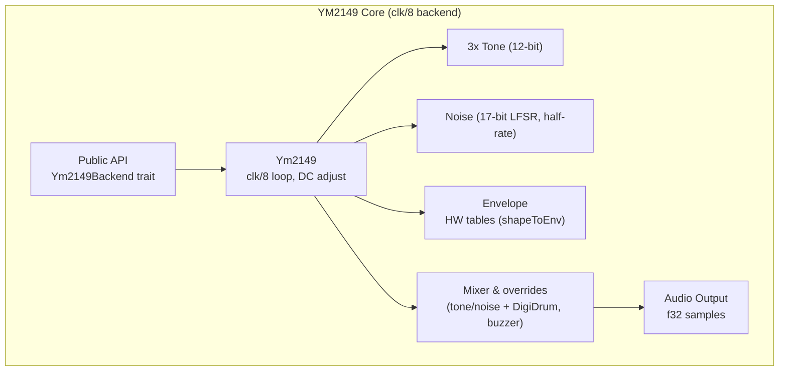

# YM2149 Core Architecture

Hardware-accurate emulation of the Yamaha YM2149 Programmable Sound Generator chip.

## Scope

This document describes the **ym2149-core** crate only. For the overall workspace architecture including YM file parsing, playback, and Bevy integration, see the [root ARCHITECTURE.md](../../ARCHITECTURE.md).

## System Overview



## Hardware Emulation (clk/8 backend)

The backend uses a compact clk/8 stepping model:
- Internal YM tick at `master_clock / 8` (~250 kHz @ 2 MHz), averaged to host sample rate.
- Randomized tone edge power-on state to mirror real hardware.
- Noise LFSR ticks at half-rate.
- 10 hardware envelope shapes (128-step tables) with shapeToEnv mapping (R13).
- 32-step hardware volume table; 5-bit envelope levels.
- DC adjust ring buffer (~20 ms window) to remove offset drift.
- DigiDrum injection uses integer samples (no clipping), mixer overrides for SID/buzzer.
- Color filter is a no-op in this backend (ST-style postfilter handled elsewhere if needed).

### Clock Flow (per host sample)

```
ComputeNextSample:
  loop while inner_cycle < ym_clock/8:
    Tick tone/noise/env once (clk/8)
    inner_cycle += host_rate
  inner_cycle -= ym_clock/8
  Resolve env level + mixer masks, apply mixer overrides
  Map to 32-step log volume table (per channel), handle half-shift for period<=1
  Sum A/B/C, DC adjust, normalize to f32
```

### Register Map

```
R0-R1:   Channel A frequency (12-bit)
R2-R3:   Channel B frequency (12-bit)
R4-R5:   Channel C frequency (12-bit)
R6:      Noise frequency divider (5-bit)
R7:      Mixer control (bits 0-2: tone enable, bits 3-5: noise enable)
R8:      Channel A amplitude (bits 0-3) + envelope flag (bit 4)
R9:      Channel B amplitude
R10:     Channel C amplitude
R11-R12: Envelope frequency divider (16-bit)
R13:     Envelope shape (4-bit: 16 waveforms)
R14-R15: I/O ports (not emulated)
```

### Key Components

- **Tone**: 3× counters at clk/8; period ≤1 halves amplitude (hardware behaviour).
- **Noise**: 17-bit LFSR, half-rate tick, same tap/rollover as reference.
- **Envelope**: 10 shapes, 128-entry tables; shapeToEnv mapping from R13; start at `env_pos = -64` like reference.
- **Mixer**: Masks from R7; effect overrides for SID/buzzer/digidrum; drum samples injected as integer PCM.
- **Output conditioning**: DC adjust (ring buffer).

---

## Backend Trait

The `Ym2149Backend` trait provides a common interface for all chip implementations:

```rust
pub trait Ym2149Backend: Send {
    // Core methods (required)
    fn new() -> Self where Self: Sized;
    fn with_clocks(master_clock: u32, sample_rate: u32) -> Self where Self: Sized;
    fn reset(&mut self);
    fn write_register(&mut self, addr: u8, value: u8);
    fn read_register(&self, addr: u8) -> u8;
    fn load_registers(&mut self, regs: &[u8; 16]);
    fn dump_registers(&self) -> [u8; 16];
    fn clock(&mut self);
    fn get_sample(&self) -> f32;
    fn generate_samples(&mut self, count: usize) -> Vec<f32>;
    fn get_channel_outputs(&self) -> (f32, f32, f32);
    fn set_channel_mute(&mut self, channel: usize, mute: bool);
    fn is_channel_muted(&self, channel: usize) -> bool;
    fn set_color_filter(&mut self, enabled: bool);

    // Hardware-specific methods (default no-ops for compatibility)
    fn trigger_envelope(&mut self) { /* no-op */ }
    fn set_drum_sample_override(&mut self, _channel: usize, _sample: Option<f32>) { /* no-op */ }
    fn set_mixer_overrides(&mut self, _force_tone: [bool; 3], _force_noise_mute: [bool; 3]) { /* no-op */ }
}
```

**Implementations:**
- `Ym2149` (this crate): Hardware-accurate emulation with full YM6 effect support
- `SoftSynth` (ym2149-softsynth crate): Experimental synthesizer (effects ignored via default trait methods)

**Generic Player:**
The `Ym6PlayerGeneric<B: Ym2149Backend>` in ym2149-ym-replayer uses this trait, allowing any backend. The type alias `Ym6Player = Ym6PlayerGeneric<Ym2149>` provides the common hardware-accurate default.

---

## Effect Support Methods

The `Ym2149` implementation provides additional public methods for hardware effects (used by ym2149-ym-replayer):

### Mixer Overrides
```rust
pub fn set_mixer_overrides(&mut self, force_tone: [bool; 3], force_noise_mute: [bool; 3])
```
Used by SID voice and Sync Buzzer effects to override mixer settings.

### DigiDrum Support
```rust
pub fn set_drum_sample_override(&mut self, voice: usize, sample: Option<i32>)
```
Allows injecting drum sample values directly into channel outputs.

### Envelope Triggering
```rust
pub fn trigger_envelope(&mut self, shape: u8)
```
Immediate envelope restart, used by Sync Buzzer effect.

**Note**: These methods are hardware-specific and provided as trait default methods (no-ops) in the `Ym2149Backend` trait. The `Ym6PlayerGeneric<B: Ym2149Backend>` player is generic over backends, but YM6 hardware effects are only available when using the concrete `Ym2149` implementation (via the `Ym6Player` type alias or explicitly as `Ym6PlayerGeneric<Ym2149>`). Alternative backends like `SoftSynth` will compile but ignore these hardware-specific features.

---

## Performance

| Operation | Time | CPU |
|-----------|------|-----|
| Ym2149.clock() | ~1-2 µs per sample | ~5% per core |
| generate_samples(882) | ~1-2 ms per frame | typical VBL period |
| Total @ 44.1 kHz | ~45-90 ms per second | ~5% sustained |

Low CPU overhead enables playback on modest systems.

---

## Key Design Decisions

1. **Fixed-point phase accumulators** (16.16 format) for sub-sample frequency precision
2. **Pre-computed envelope lookup tables** (16 shapes × 65K values) for smooth, fast amplitude modulation
3. **Zero allocations** in sample generation hot path
4. **Hardware-accurate mixer logic** with proper AND gate behavior
5. **Trait-based backend** for alternative implementations (e.g., SoftSynth)
6. **Public effect methods** to support YM6 playback without breaking encapsulation

---

## Module Organization

```
ym2149-core/src/
├── ym2149/
│   ├── chip.rs           # Main Ym2149 implementation (clk/8, envelopes, noise, mixer)
│   ├── constants.rs      # Volume table, helpers
│   └── psg_bank.rs       # Multi-PSG bank (Arkos/PlayCity)
├── backend.rs            # Ym2149Backend trait
├── streaming/            # Optional audio output (feature: streaming)
├── visualization/        # Terminal UI helpers (feature: visualization)
└── lib.rs                # Public API exports
```

---

## Deprecated Modules (v0.6.0)

The following modules are deprecated and maintained only for backward compatibility. Use the new crates instead:

- `compression/` → Use `ym2149-ym-replayer` crate
- `ym_parser/` → Use `ym2149-ym-replayer` crate
- `ym_loader/` → Use `ym2149-ym-replayer` crate
- `replayer/` → Use `ym2149-ym-replayer` crate

---

## Related Documentation

- [Workspace Architecture](../../ARCHITECTURE.md) - Overall system design
- [Streaming Guide](../../STREAMING_GUIDE.md) - Real-time audio output details
- [API Documentation](https://docs.rs/ym2149) - Full API reference
