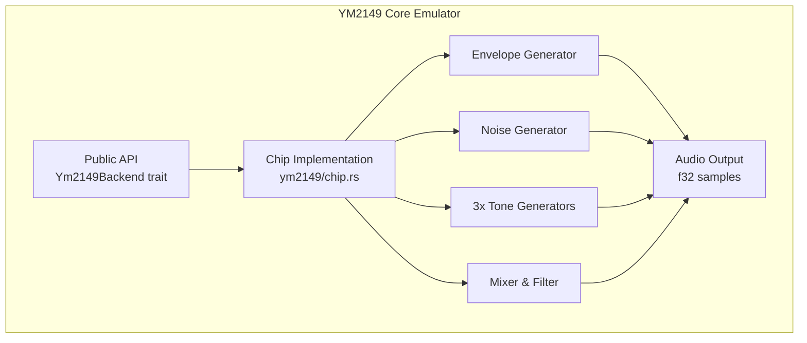
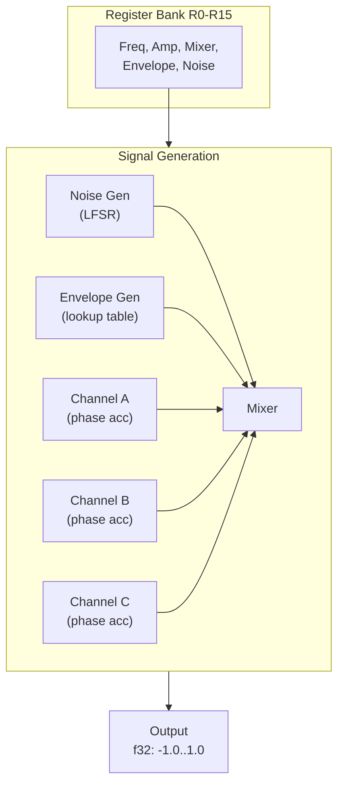

# YM2149 Core Architecture

Hardware-accurate emulation of the Yamaha YM2149 Programmable Sound Generator chip.

## Scope

This document describes the **ym2149-core** crate only. For the overall workspace architecture including YM file parsing, playback, and Bevy integration, see the [root ARCHITECTURE.md](../../ARCHITECTURE.md).

## System Overview



## Hardware Emulation (ym2149/)

The chip is a pure hardware emulator with sample-by-sample synthesis.

### Chip Structure



### Clock Flow (44.1 kHz)

Each output sample is generated by calling `clock()` once:

```
clock() [called at 44.1 kHz sample rate]
  ├─ envelope_gen.clock()        → Amplitude: 0-15
  ├─ noise_gen.clock()           → Noise bit: 0 or 1
  ├─ channel_a/b/c.clock()       → Waveform: ±1.0 (square)
  ├─ Apply mixer masks (R7)      → Enable/disable tone & noise per channel
  ├─ Hardware AND gate logic     → Combine tone & noise waveforms
  ├─ Apply amplitude (register or envelope)
  └─ Sum channels & color filter → Output sample (-1.0 to 1.0)
```

### Register Map

```
R0-R1:   Channel A frequency (12-bit)
R2-R3:   Channel B frequency (12-bit)
R4-R5:   Channel C frequency (12-bit)
R6:      Noise frequency divider (5-bit)
R7:      Mixer control (bits 0-2: tone enable, bits 3-5: noise enable)
R8:      Channel A amplitude (bits 0-3) + envelope flag (bit 4)
R9:      Channel B amplitude
R10:     Channel C amplitude
R11-R12: Envelope frequency divider (16-bit)
R13:     Envelope shape (4-bit: 16 waveforms)
R14-R15: I/O ports (not emulated)
```

### Key Components

#### Envelope Generator
- **16 waveform shapes**: attack, decay, release, sustain, buzzer, hold, sawtooth modes
- **Mechanism**: 16-bit phase accumulator clocked by frequency divider (R11-12)
- **Output**: 0-15 amplitude value via pre-computed lookup table
- **Effect**: Smooth amplitude modulation for expressive tones

#### Channels (Tone Generators)
- **Waveform**: Square via phase accumulator (hardware)
- **Frequency**: Extracted from 12-bit register value + master clock divider
- **Phase accumulation**: 32-bit fixed-point (16.16) for sub-sample precision
- **Output**: ±1.0 float amplitude, modulated by register or envelope

#### Noise Generator
- **Type**: 17-bit Linear Feedback Shift Register (LFSR)
- **Frequency**: Divider-based clock, controlled by R6
- **Output**: Single white noise bit (0 or 1)
- **Hardware-accurate**: Matches YM2149 tap positions

#### Mixer
- **Gate logic**: Hardware AND combines tone and noise per channel
- **Enable mask**: R7 bits control which channels produce output
- **Effect overrides**: SID/DigiDrum can force channels on/off (via public methods)
- **Output combining**: Simple addition of 3 channels (auto-scales)
- **Color filter**: Optional ST-style filter for authentic tone

---

## Backend Trait

The `Ym2149Backend` trait provides a common interface for all chip implementations:

```rust
pub trait Ym2149Backend: Send {
    fn new() -> Self where Self: Sized;
    fn with_clocks(master_clock: u32, sample_rate: u32) -> Self where Self: Sized;
    fn reset(&mut self);
    fn write_register(&mut self, addr: u8, value: u8);
    fn read_register(&self, addr: u8) -> u8;
    fn load_registers(&mut self, regs: &[u8; 16]);
    fn dump_registers(&self) -> [u8; 16];
    fn clock(&mut self);
    fn get_sample(&self) -> f32;
    fn generate_samples(&mut self, count: usize) -> Vec<f32>;
    fn get_channel_outputs(&self) -> (f32, f32, f32);
    fn set_channel_mute(&mut self, channel: usize, mute: bool);
    fn is_channel_muted(&self, channel: usize) -> bool;
    fn set_color_filter(&mut self, enabled: bool);
}
```

**Implementations:**
- `Ym2149` (this crate): Hardware-accurate emulation
- `SoftSynth` (ym-softsynth crate): Experimental synthesizer

---

## Effect Support Methods

The `Ym2149` implementation provides additional public methods for hardware effects (used by ym-replayer):

### Mixer Overrides
```rust
pub fn set_mixer_overrides(&mut self, force_tone: [bool; 3], force_noise_mute: [bool; 3])
```
Used by SID voice and Sync Buzzer effects to override mixer settings.

### DigiDrum Support
```rust
pub fn set_drum_sample_override(&mut self, voice: usize, sample: Option<i32>)
```
Allows injecting drum sample values directly into channel outputs.

### Envelope Triggering
```rust
pub fn trigger_envelope(&mut self, shape: u8)
```
Immediate envelope restart, used by Sync Buzzer effect.

**Note**: These methods are hardware-specific and not part of the `Ym2149Backend` trait, which is why YM6 effects require the concrete `Ym2149` type.

---

## Performance

| Operation | Time | CPU |
|-----------|------|-----|
| Ym2149.clock() | ~1-2 µs per sample | ~5% per core |
| generate_samples(882) | ~1-2 ms per frame | typical VBL period |
| Total @ 44.1 kHz | ~45-90 ms per second | ~5% sustained |

Low CPU overhead enables playback on modest systems.

---

## Key Design Decisions

1. **Fixed-point phase accumulators** (16.16 format) for sub-sample frequency precision
2. **Pre-computed envelope lookup tables** (16 shapes × 65K values) for smooth, fast amplitude modulation
3. **Zero allocations** in sample generation hot path
4. **Hardware-accurate mixer logic** with proper AND gate behavior
5. **Trait-based backend** for alternative implementations (e.g., SoftSynth)
6. **Public effect methods** to support YM6 playback without breaking encapsulation

---

## Module Organization

```
ym2149-core/src/
├── ym2149/
│   ├── chip.rs           # Main Ym2149 implementation
│   ├── channel.rs        # Tone generator (square wave)
│   ├── envelope.rs       # Envelope generator with 16 shapes
│   ├── noise.rs          # 17-bit LFSR noise generator
│   ├── mixer.rs          # Channel mixing and filtering
│   ├── constants.rs      # Clock rates, frequencies
│   └── registers.rs      # Register definitions
├── backend.rs            # Ym2149Backend trait
├── mfp.rs                # MFP timer helpers
├── streaming/            # Optional audio output (feature: streaming)
├── visualization/        # Terminal UI helpers (feature: visualization)
└── lib.rs                # Public API exports
```

---

## Deprecated Modules (v0.6.0)

The following modules are deprecated and maintained only for backward compatibility. Use the new crates instead:

- `compression/` → Use `ym-replayer` crate
- `ym_parser/` → Use `ym-replayer` crate
- `ym_loader/` → Use `ym-replayer` crate
- `replayer/` → Use `ym-replayer` crate

---

## Related Documentation

- [Workspace Architecture](../../ARCHITECTURE.md) - Overall system design
- [Streaming Guide](../../STREAMING_GUIDE.md) - Real-time audio output details
- [API Documentation](https://docs.rs/ym2149) - Full API reference
