# YM2149-RS Architecture

A modular YM2149 PSG emulator with real-time streaming playback, designed for accurate hardware emulation and low-latency audio output.

## System Overview

```mermaid
graph LR
    A["YM File\n(YM2–YM6)"] --> B["Decompress (LHA)\n(feature: ym-format)"]
    B --> C["Parse Format\nYM2/3/3b/4/5/6"]
    C --> D["Replayer\n(frames + effects)"]
    D --> E["Ring Buffer\n(concurrent)"]
    E --> F["Audio Device\n(rodio)"]
    D --> G["YM2149 Chip\n(integer-accurate)"]
    D --> H["Experimental\nSoftSynth"]
    D --> I["CLI Viz"]
```



## Module Organization

| Module | Lines | Purpose |
|--------|-------|---------|
| `ym2149/` | Core YM chip (chip, envelope, mixer, constants, registers) |
| `replayer/` | Playback orchestration (frames, VBL sync, effects) |
| `ym_parser/` | YM format parsing (YM3/3b/4/5 and YM6; de‑interleave YM2/3) |
| `streaming/` | Concurrent ring buffer & audio device (rodio) |
| `compression/` | LHA/LZH decompression |
| `softsynth/` | Experimental synth engine |
| `visualization/` | Terminal UI helpers |

---

## Hardware Emulation (ym2149/)

The chip is a pure hardware emulator with sample-by-sample synthesis.

### Chip Structure


### Clock Flow (44.1 kHz)

Each output sample is generated by calling `clock()` once:

```
clock() [called at 44.1 kHz sample rate]
  ├─ envelope_gen.clock()        → Amplitude: 0-15
  ├─ noise_gen.clock()           → Noise bit: 0 or 1
  ├─ channel_a/b/c.clock()       → Waveform: ±1.0 (square)
  ├─ Apply mixer masks (R7)      → Enable/disable tone & noise per channel
  ├─ Hardware AND gate logic     → Combine tone & noise waveforms
  ├─ Apply amplitude (register or envelope)
  └─ Sum channels & color filter → Output sample (-1.0 to 1.0)
```

### Register Map

```
R0-R1:   Channel A frequency (12-bit)
R2-R3:   Channel B frequency (12-bit)
R4-R5:   Channel C frequency (12-bit)
R6:      Noise frequency divider (5-bit)
R7:      Mixer control (bits 0-2: tone enable, bits 3-5: noise enable)
R8:      Channel A amplitude (bits 0-3) + envelope flag (bit 4)
R9:      Channel B amplitude
R10:     Channel C amplitude
R11-R12: Envelope frequency divider (16-bit)
R13:     Envelope shape (4-bit: 16 waveforms)
R14-R15: I/O ports (not emulated)
```

### Key Components

#### Envelope Generator
- **16 waveform shapes**: attack, decay, release, sustain, buzzer, hold, sawtooth modes
- **Mechanism**: 16-bit phase accumulator clocked by frequency divider (R11-12)
- **Output**: 0-15 amplitude value via pre-computed lookup table
- **Effect**: Smooth amplitude modulation for expressive tones

#### Channels (Tone Generators)
- **Waveform**: Square via phase accumulator (hardware)
- **Frequency**: Extracted from 12-bit register value + master clock divider
- **Phase accumulation**: 32-bit fixed-point (16.16) for sub-sample precision
- **Output**: ±1.0 float amplitude, modulated by register or envelope

#### Noise Generator
- **Type**: 17-bit Linear Feedback Shift Register (LFSR)
- **Frequency**: Divider-based clock, controlled by R6
- **Output**: Single white noise bit (0 or 1)
- **Hardware-accurate**: Matches YM2149 tap positions

#### Mixer
- **Gate logic**: Hardware AND combines tone and noise per channel
- **Enable mask**: R7 bits control which channels produce output
- **Effect overrides**: SID/DigiDrum can force channels on/off
- **Output combining**: Simple addition of 3 channels (auto-scales)
- **Color filter**: Optional ST-style filter for authentic tone

---

## Streaming Playback (replayer/)

Frame-based VBL-synced playback with SID, DigiDrum, and Sync Buzzer effects.

### Playback State Machine


### Frame-Based Playback

The unified replayer manages playback by operating on register **frames** (snapshots of all 16 registers at a single time):

```
┌───────────────────────────────────────────┐
│ Load Song (parsing)                       │
├───────────────────────────────────────────┤
│ frames: Vec<[u8; 16]>     100-1000 frames │
│ samples_per_frame: u32    882 @ 50Hz      │
│ loop_point: Option<usize> Frame to loop   │
└───────────────────────────────────────────┘
                  ↓
        ┌─────────────────────┐
        │ Playback Loop       │
        │ (sample generation) │
        │ 44,100 samples/sec  │
        └────────┬────────────┘
                 │
            Every frame (882 samples):
              1. Load registers from frames[current_frame]
              2. Parse and apply effects (YM5/YM6 only)
              3. Generate 882 samples
              4. Advance to next frame
              5. If at loop_point → restart
```

### Sample Generation Algorithm

```
generate_sample() [called 44,100 times/sec]

  if not Playing → return 0.0

  if samples_in_frame == 0:
    # Load register frame (once per 882 samples)
    regs = frames[current_frame]
    chip.load_registers(regs)

    # Decode and apply effects for this frame
    effects = decode_effects(regs)
    for effect in effects:
      if SID: effects_mgr.start_sid(voice, freq, volume)
      if DigiDrum: effects_mgr.start_digidrum(voice, sample_idx, speed)
      if SyncBuzzer: effects_mgr.start_buzzer(freq)

  # Core emulation: advance by one sample
  chip.clock()

  # Update effect states for this sample
  effects_mgr.update()

  # Get output sample
  sample = chip.get_sample()

  # Increment frame position
  samples_in_frame += 1
  if samples_in_frame >= samples_per_frame:
    samples_in_frame = 0
    current_frame += 1
    if current_frame >= frames.len():
      if loop_point:
        current_frame = loop_point  # Restart
      else:
        state = Stopped

  return sample
```

### Effects

Three independent effects can modify the chip output:

| Effect | Mechanism | Use |
|--------|-----------|-----|
| **SID** | Amplitude gating at 4-8 kHz frequency | "Sidekick" voice timbre |
| **DigiDrum** | Sample playback at variable speed | Drum/percussion samples |
| **Sync Buzzer** | Fast envelope retriggering | Buzzer/trill sounds |

Effects are decoded from register frame data and applied per-sample during generation.

---

## Real-Time Streaming (streaming/)

Multi-threaded architecture with lock-free ring buffer for decoupled sample generation and audio output.

### Threading Model

```mermaid
graph LR
    subgraph Threads["Concurrent Threads"]
        A["🔵 Playback<br/>generate_samples<br/>44.1 kHz"]
        B["🔴 Audio Out<br/>CPAL callback<br/>~11 Hz"]
        C["🟢 Visualization<br/>Status display<br/>20 Hz"]
    end

    A -->|write| RB["Ring Buffer<br/>4-16 KB<br/>lock-free"]
    B -->|read| RB
    C -->|read state| RB
```



### Ring Buffer (Lock-Free)

A circular buffer decouples sample generation from audio output:

```
Structure:
  ├─ buffer: Arc<Vec<f32>>             (shared sample storage)
  ├─ write_pos: Arc<AtomicUsize>       (producer position)
  ├─ read_pos: Arc<AtomicUsize>        (consumer position)
  └─ capacity: usize (power of 2, e.g., 4096)

Operations:
  write(samples):
    ├─ Calculate available space
    ├─ Copy samples to circular buffer (wrap at capacity)
    └─ Atomically advance write_pos (no locks!)

  read(count):
    ├─ Calculate available samples
    ├─ Copy from circular buffer (wrap at capacity)
    └─ Atomically advance read_pos
```

**Benefits**:
- Zero-copy between threads (just pointers)
- Lock-free reads/writes (atomic operations only)
- Configurable latency (buffer size controls delay)
- Backpressure: producer sleeps if buffer full

### Latency Configuration

```
Buffer Size → Latency (at 44.1 kHz)
────────────────────────────────
4 KB        → ~93 ms (low-latency, risk underruns)
8 KB        → ~186 ms
16 KB       → ~372 ms (stable, standard)
32 KB       → ~744 ms (very stable)

Total end-to-end: 120-150 ms (buffer + OS + audio device)
```

---

## Data Flow

### File Loading Pipeline


### Sample Generation → Output


---

## File Format Support

| Format | Frames | Regs | Metadata | Effects | Drums |
|--------|--------|------|----------|---------|-------|
| YM2 | Raw | 14 | ❌ | ❌ | ❌ |
| YM3/3b | Raw | 14 | ✓ | ❌ | ❌ |
| YM4 | Raw | 14 | ✓ | ❌ | ✓ |
| YM5 | Raw | 16 | ✓ | ✓ | ✓ |
| YM6 | Commands | 16 | ✓ | ✓ | ✓ |

All formats transparently decompress if LHA-compressed.

---

## Performance

| Operation | Time | CPU |
|-----------|------|-----|
| YM2149.clock() | ~1-2 µs per sample | ~5% per core |
| Effects update | ~0.2-0.5 µs | included above |
| Ring buffer ops | ~0.1 µs (atomic only) | negligible |
| Total @ 44.1 kHz | ~45-90 ms per second | ~5% sustained |

Low CPU overhead enables playback on modest systems.

---

## Key Design Decisions

1. **Fixed-point phase accumulators** (16.16 format) for sub-sample frequency precision
2. **Pre-computed envelope lookup tables** (16 shapes × 65K values) for smooth, fast amplitude modulation
3. **Lock-free ring buffer** with atomic positions for zero-copy inter-thread communication
4. **Frame-based playback** mimicking ATARI ST VBL interrupts @ 50Hz
5. **Effects decoupled from core emulation** for clean separation and testability
6. **Transparent decompression** supporting multiple file format versions

---

## Related Code Locations

- **Main entry**: `src/main.rs` - CLI and threading setup
- **Chip emulation**: `src/ym2149/chip.rs` - Core sample generation loop
- **Playback orchestration**: `src/replayer/ym_player.rs` - Frame loading and effects
- **Ring buffer**: `src/streaming/ring_buffer.rs` - Lock-free circular buffer
- **Audio output**: `src/streaming/audio_device.rs` - CPAL integration
- **File parsing**: `src/ym_parser/` - Format detection and frame extraction
