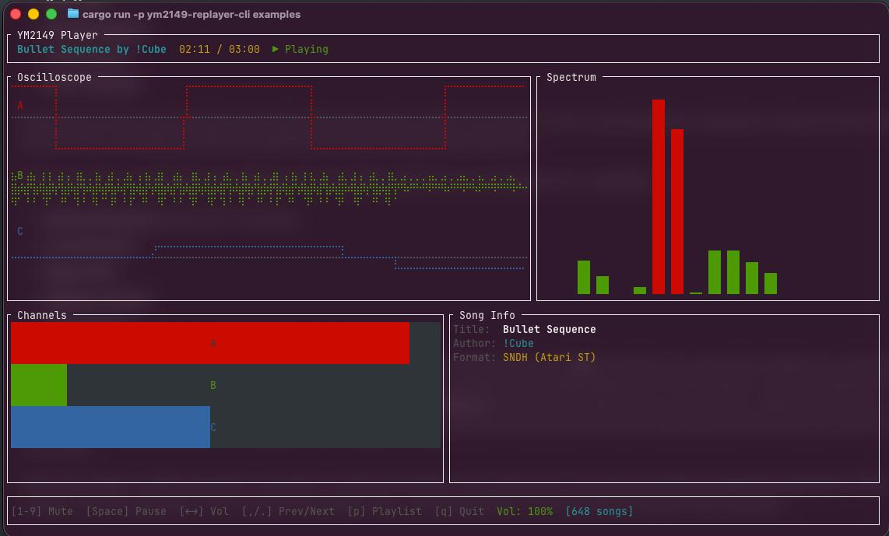
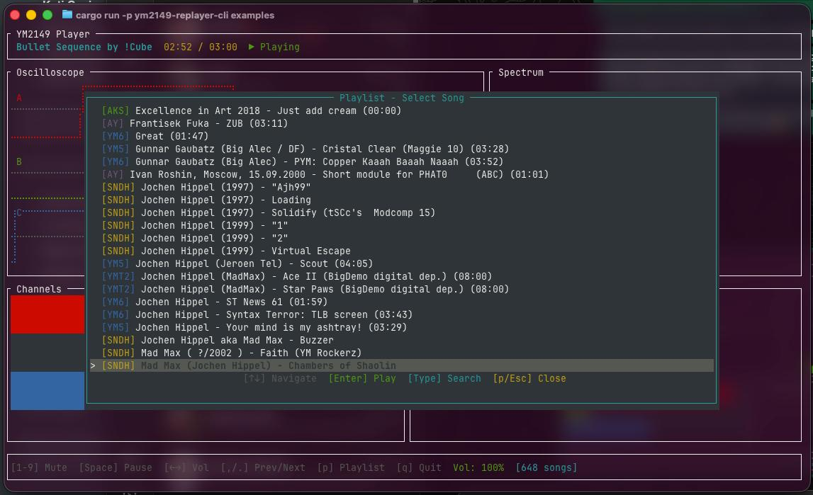

# ym2149-replayer-cli

A feature-rich command-line player for YM2149/AY-3-8910 chiptune files with a modern TUI interface.

## Screenshots

### Player View



*TUI player showing oscilloscope, spectrum analyzer, channel levels, and song metadata*

### Playlist View



*Playlist overlay with type-ahead search for browsing music collections*

## Features

- **Multiple Format Support**: Play YM (YM2, YM3, YM5, YM6), AKS (Arkos Tracker), AY (ZX Spectrum), and SNDH (Atari ST) files
- **Modern TUI Interface**: Built with [ratatui](https://ratatui.rs/) featuring:
  - Real-time oscilloscope waveform display
  - Spectrum analyzer visualization
  - Per-channel volume meters
  - Song metadata display
- **Directory Mode**: Recursively scan directories and browse with an interactive playlist
- **Type-Ahead Search**: Quickly find songs by typing in the playlist overlay
- **Channel Muting**: Mute individual channels (up to 12 channels for multi-PSG songs)
- **Subsong Support**: Navigate between subsongs in multi-song files (SNDH, AY)
- **Volume Control**: Adjust master volume in real-time
- **Auto-Advance**: Automatically play the next song when the current one ends

## Installation

### From Source

```bash
# Clone the repository
git clone https://github.com/slippyex/ym2149-rs.git
cd ym2149-rs

# Build and install
cargo install --path crates/ym2149-replayer-cli
```

The binary will be installed as `ym-replayer`.

### Requirements

- Rust 1.75 or later
- Audio output device (uses rodio/cpal for cross-platform audio)

## Usage

```bash
# Play a single file
ym-replayer song.ym

# Browse a directory of chiptunes
ym-replayer ~/music/chiptunes/

# Disable the ST-style color filter
ym-replayer --no-color-filter song.sndh

# Show help
ym-replayer --help
```

## Keyboard Controls

### Main Player View

| Key | Action |
|-----|--------|
| `Space` | Pause/Resume playback |
| `1`-`9`, `0` | Toggle mute for channels 1-10 |
| `Up` | Next subsong |
| `Down` | Previous subsong |
| `Left` / `Right` | Decrease/Increase volume |
| `.` / `>` / `]` | Next song (playlist mode) |
| `,` / `<` / `[` | Previous song (playlist mode) |
| `p` | Open/Close playlist overlay |
| `q` | Quit |

### Playlist Overlay

| Key | Action |
|-----|--------|
| `Up` / `Down` | Navigate list / Jump to matches when searching |
| `Page Up` / `Page Down` | Scroll by 10 items |
| `Enter` | Play selected song |
| `Type any character` | Start type-ahead search |
| `Backspace` | Delete last search character |
| `Esc` | Clear search / Close overlay |
| `p` | Close overlay |

## Supported Formats

| Format | Extension | Description |
|--------|-----------|-------------|
| **YM** | `.ym` | Leonard/Arnaud Carré format (YM2, YM3, YM5, YM6) |
| **AKS** | `.aks` | Arkos Tracker 2/3 songs (supports multi-PSG) |
| **AY** | `.ay` | ZX Spectrum ZXAY/EMUL format |
| **SNDH** | `.sndh` | Atari ST format with 68000 emulation |

## Architecture

The CLI is built on top of the ym2149-rs ecosystem:

```
ym2149-replayer-cli
├── ym2149-core          # Core YM2149 chip emulation
├── ym2149-ym-replayer   # YM format parser and player
├── ym2149-arkos-replayer # Arkos Tracker format support
├── ym2149-ay-replayer   # AY/EMUL format support
├── ym2149-sndh-replayer # SNDH format with 68000 emulation
└── ym2149-common        # Shared types and traits
```

### Audio Pipeline

1. **Sample Generation**: Player generates samples at 44.1kHz
2. **Ring Buffer**: Lock-free ring buffer for producer-consumer audio streaming
3. **Color Filter**: Optional ST-style low-pass filter for authentic sound
4. **Audio Output**: rodio/cpal for cross-platform audio playback

## Configuration

### Command-Line Options

| Option | Description |
|--------|-------------|
| `--no-color-filter` | Disable the ST-style color filter (enabled by default) |
| `--chip <mode>` | Select synthesis engine (currently only `ym2149`) |
| `-h`, `--help` | Show help message |

### Terminal Requirements

The TUI mode requires a terminal with at least 80 columns and 24 rows. If the terminal is too small, the player falls back to a simple text-based visualization.

## Examples

```bash
# Play a classic Atari ST tune
ym-replayer music/mad_max_tune.sndh

# Browse your entire chiptune collection
ym-replayer ~/Music/Chiptunes/

# Play an Arkos Tracker song with color filter disabled
ym-replayer --no-color-filter demo.aks
```

## Troubleshooting

### No Sound

- Check that your audio device is working
- Try running with `RUST_LOG=debug` for more information
- Ensure the file format is supported

### TUI Not Showing

- Make sure your terminal is at least 80x24 characters
- Try resizing your terminal window
- Some terminal emulators may not support the required features

### High CPU Usage

- This is normal for SNDH files as they require 68000 CPU emulation
- YM and AKS files should have minimal CPU usage

## License

This project is licensed under the MIT License - see the [LICENSE](../../LICENSE) file for details.

## Related Projects

- [ym2149-rs](https://github.com/your-repo/ym2149-rs) - The parent workspace containing all crates
- [Arkos Tracker](https://www.julien-nevo.com/arkostracker/) - Music tracker for YM2149-based systems
- [SNDH Archive](https://sndh.atari.org/) - Large collection of Atari ST music
